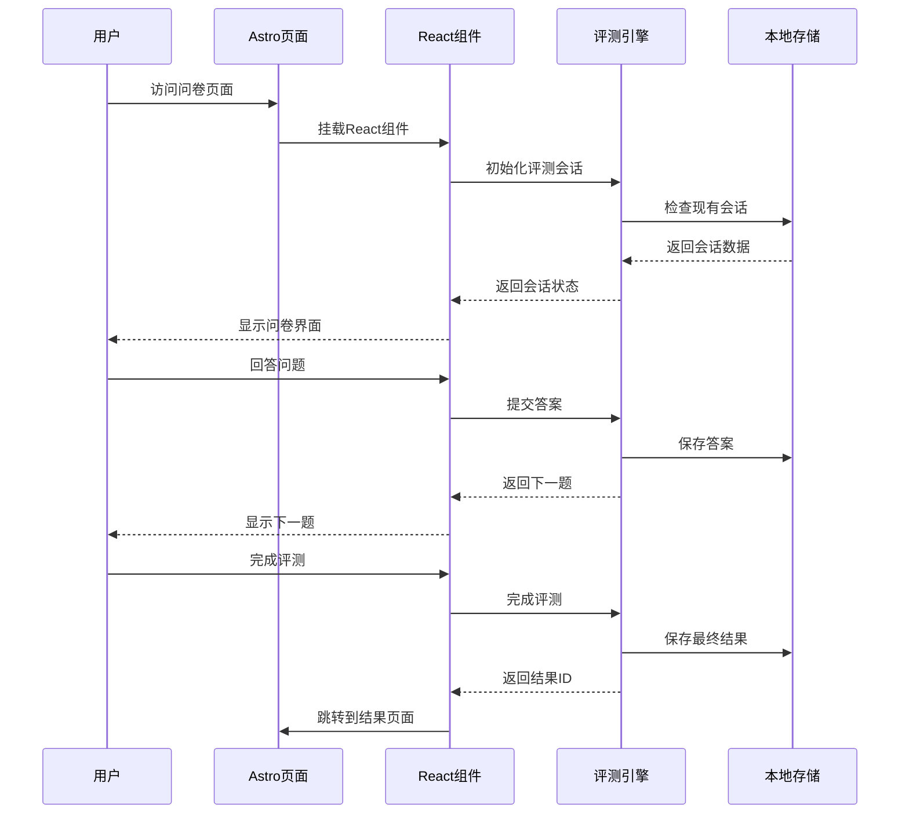

# 评估系统修复设计文档

## 概述

本设计文档针对现有心理健康评估系统的三个关键问题提供解决方案：
1. 修复评测首页缺失的问卷入口链接
2. 正确处理客户端TypeScript代码和服务端代码的分离
3. 将问卷内容页面改为纯客户端渲染的React组件形式

设计采用Astro框架的混合渲染模式，确保静态内容在服务端生成，动态交互在客户端执行。

## 架构设计

### 整体架构图

```mermaid
graph TB
    subgraph "服务端渲染 (SSR)"
        INDEX[评测首页 - index.astro]
        STATIC_DATA[静态问卷数据]
        QUESTION_BANK[问卷题库管理器]
    end
    
    subgraph "客户端渲染 (CSR)"
        REACT_COMPONENT[问卷React组件]
        ASSESSMENT_ENGINE[评测引擎 - TypeScript]
        LOCAL_STORAGE[本地存储管理]
        STATE_MANAGER[状态管理]
    end
    
    subgraph "混合页面"
        TAKE_PAGE[问卷执行页面 - take/[id].astro]
    end
    
    INDEX --> QUESTION_BANK
    INDEX --> TAKE_PAGE
    TAKE_PAGE --> REACT_COMPONENT
    REACT_COMPONENT --> ASSESSMENT_ENGINE
    ASSESSMENT_ENGINE --> LOCAL_STORAGE
    REACT_COMPONENT --> STATE_MANAGER
    QUESTION_BANK --> STATIC_DATA
```

## 组件设计

### 1. 评测首页修复设计

#### 问题分析
当前评测首页的问卷入口链接存在以下问题：
- 按钮点击事件处理不正确
- 缺少正确的路由导航
- JavaScript代码在服务端执行导致错误

#### 解决方案

**服务端部分 (index.astro) - 静态生成链接**
```astro
---
// 服务端代码 - 生成静态内容
import { questionBankManager } from '@/lib/assessment/QuestionBankManager';
import { getAssessmentTranslations } from '@/locales/assessment';
import ContinueAssessmentWidget from '@/components/assessment/ContinueAssessmentWidget';

const assessmentTypes = questionBankManager.getAssessmentTypes();
const t = getAssessmentTranslations(currentLang);
---

<main>
  <!-- 继续评测组件 - 客户端渲染 -->
  <ContinueAssessmentWidget client:load />

  <!-- 问卷列表 - 服务端静态生成 -->
  {assessmentTypes.map((assessment) => (
    <div class="assessment-card">
      <h3>{assessment.name}</h3>
      <p>{assessment.description}</p>
      <!-- 直接使用静态链接，无需JavaScript -->
      <a 
        href={`/assessment/take/${assessment.id}/`}
        class="start-assessment-btn"
      >
        {t.list.startButton}
      </a>
    </div>
  ))}
</main>
```

**客户端组件 - 继续评测功能**
```tsx
// @/components/assessment/ContinueAssessmentWidget.tsx
import { useState, useEffect } from 'react';
import { assessmentEngine } from '@/lib/assessment/AssessmentEngine';
import { useTranslations } from '@/hooks/useTranslations';

export default function ContinueAssessmentWidget() {
  const [activeSessions, setActiveSessions] = useState([]);
  const [isLoading, setIsLoading] = useState(true);
  const t = useTranslations('assessment');

  useEffect(() => {
    loadActiveSessions();
  }, []);

  const loadActiveSessions = async () => {
    try {
      const sessions = assessmentEngine.getActiveSessions();
      setActiveSessions(sessions);
    } catch (error) {
      console.error('Failed to load active sessions:', error);
    } finally {
      setIsLoading(false);
    }
  };

  if (isLoading) {
    return <div className="animate-pulse bg-gray-200 h-16 rounded-lg"></div>;
  }

  if (activeSessions.length === 0) {
    return null;
  }

  return (
    <div className="bg-blue-50 dark:bg-blue-900/20 border border-blue-200 dark:border-blue-800 rounded-lg p-4 mb-8">
      <div className="flex items-center">
        <svg className="w-5 h-5 text-blue-600 dark:text-blue-400 mr-3" fill="currentColor" viewBox="0 0 20 20">
          <path fillRule="evenodd" d="M18 10a8 8 0 11-16 0 8 8 0 0116 0zm-7-4a1 1 0 11-2 0 1 1 0 012 0zM9 9a1 1 0 000 2v3a1 1 0 001 1h1a1 1 0 100-2v-3a1 1 0 00-1-1H9z" clipRule="evenodd"></path>
        </svg>
        <div>
          <h3 className="text-sm font-medium text-blue-800 dark:text-blue-200">
            {t('list.activeSessions.title', { count: activeSessions.length })}
          </h3>
          <p className="text-sm text-blue-700 dark:text-blue-300 mt-1">
            <a href="/assessment/continue/" className="underline hover:no-underline">
              {t('list.activeSessions.continueLink')}
            </a>
          </p>
        </div>
      </div>
    </div>
  );
}
```

### 2. 客户端/服务端代码分离设计

#### 代码分离原则

**服务端代码 (.astro frontmatter)**
- 静态数据获取
- 页面结构生成
- SEO元数据设置
- 国际化处理

**客户端代码 (TypeScript/React)**
- 用户交互处理
- 状态管理
- 本地存储操作
- 动态内容更新

#### 文件结构设计

```
src/
├── pages/assessment/
│   ├── index.astro                 # 服务端渲染首页
│   └── take/[id].astro            # 混合渲染问卷页面
├── components/assessment/
│   ├── AssessmentTaker.tsx        # 纯客户端React组件
│   ├── QuestionCard.tsx           # 问题卡片组件
│   ├── ProgressBar.tsx            # 进度条组件
│   ├── ContinueAssessmentWidget.tsx # 继续评测组件
│   └── ResultsDisplay.tsx         # 结果展示组件
├── lib/assessment/
│   ├── AssessmentEngine.ts        # 客户端评测引擎
│   ├── QuestionBankManager.ts     # 服务端题库管理
│   └── LocalStorageManager.ts     # 客户端存储管理
├── hooks/
│   └── useTranslations.ts         # 客户端多语言Hook
├── utils/
│   └── i18n-client.ts             # 客户端国际化工具
└── scripts/
    └── assessment-client.ts        # 客户端脚本入口
```

### 3. 纯客户端渲染问卷组件设计

#### React组件架构

```typescript
// AssessmentTaker.tsx - 主要问卷组件
interface AssessmentTakerProps {
  assessmentId: string;
  assessmentData: AssessmentType;
  initialSession?: AssessmentSession;
}

export const AssessmentTaker: React.FC<AssessmentTakerProps> = ({
  assessmentId,
  assessmentData,
  initialSession
}) => {
  // 状态管理
  const [session, setSession] = useState<AssessmentSession | null>(initialSession);
  const [currentQuestion, setCurrentQuestion] = useState<Question | null>(null);
  const [answers, setAnswers] = useState<Map<string, any>>(new Map());
  const [progress, setProgress] = useState({ current: 0, total: 0, percentage: 0 });
  const [isLoading, setIsLoading] = useState(true);
  const [error, setError] = useState<string | null>(null);

  // 评测引擎实例
  const assessmentEngine = useMemo(() => new AssessmentEngine(), []);

  // 初始化评测
  useEffect(() => {
    initializeAssessment();
  }, [assessmentId]);

  const initializeAssessment = async () => {
    try {
      setIsLoading(true);
      
      // 启动或恢复评测会话
      let currentSession = initialSession;
      if (!currentSession) {
        currentSession = assessmentEngine.startAssessment(assessmentId, 'zh');
      } else {
        currentSession = assessmentEngine.resumeAssessment(currentSession.id);
      }

      if (!currentSession) {
        throw new Error('无法启动评测会话');
      }

      setSession(currentSession);
      loadCurrentQuestion(currentSession);
      updateProgress(currentSession);
      
    } catch (err) {
      setError(err instanceof Error ? err.message : '初始化失败');
    } finally {
      setIsLoading(false);
    }
  };

  const loadCurrentQuestion = (currentSession: AssessmentSession) => {
    const question = assessmentEngine.getCurrentQuestion(currentSession.id);
    setCurrentQuestion(question);
    
    // 加载已有答案
    const existingAnswer = currentSession.answers.find(
      a => a.questionId === question?.id
    );
    if (existingAnswer && question) {
      setAnswers(prev => new Map(prev.set(question.id, existingAnswer.value)));
    }
  };

  const updateProgress = (currentSession: AssessmentSession) => {
    const progressData = assessmentEngine.getProgress(currentSession.id);
    if (progressData) {
      setProgress(progressData);
    }
  };

  const handleAnswerSubmit = async (answer: any) => {
    if (!session || !currentQuestion) return;

    try {
      const result = assessmentEngine.submitAnswer(session.id, answer);
      
      if (!result.success) {
        setError('提交答案失败，请重试');
        return;
      }

      // 更新本地状态
      setAnswers(prev => new Map(prev.set(currentQuestion.id, answer)));

      if (result.completed) {
        // 评测完成，跳转到结果页面
        await handleAssessmentComplete();
      } else {
        // 加载下一题
        loadCurrentQuestion(session);
        updateProgress(session);
      }
      
    } catch (err) {
      setError(err instanceof Error ? err.message : '提交失败');
    }
  };

  const handleAssessmentComplete = async () => {
    if (!session) return;
    
    try {
      // 分析结果
      const result = await resultsAnalyzer.analyzeSession(session);
      if (result) {
        // 跳转到结果页面
        window.location.href = `/assessment/results/${result.id}/`;
      }
    } catch (err) {
      setError('分析结果失败');
    }
  };

  // 渲染逻辑
  if (isLoading) {
    return <LoadingSpinner message="正在加载评测..." />;
  }

  if (error) {
    return <ErrorDisplay message={error} onRetry={initializeAssessment} />;
  }

  if (!session || !currentQuestion) {
    return <ErrorDisplay message="评测数据加载失败" />;
  }

  return (
    <div className="assessment-container">
      <ProgressBar 
        current={progress.current} 
        total={progress.total} 
        percentage={progress.percentage}
      />
      
      <QuestionCard
        question={currentQuestion}
        answer={answers.get(currentQuestion.id)}
        onAnswerChange={(answer) => setAnswers(prev => new Map(prev.set(currentQuestion.id, answer)))}
        onSubmit={handleAnswerSubmit}
      />
      
      <NavigationControls
        canGoBack={progress.current > 0}
        canGoNext={answers.has(currentQuestion.id)}
        onPrevious={() => {
          assessmentEngine.goToPreviousQuestion(session.id);
          loadCurrentQuestion(session);
          updateProgress(session);
        }}
        onNext={() => handleAnswerSubmit(answers.get(currentQuestion.id))}
        onSave={() => {
          // 自动保存已实现
          showSaveConfirmation();
        }}
      />
    </div>
  );
};
```

#### 问卷页面集成设计

```astro
---
// take/[id].astro - 混合渲染页面
import BaseLayout from '@/layouts/BaseLayout.astro';
import { questionBankManager } from '@/lib/assessment/QuestionBankManager';
import { getLocale } from 'astro-i18n-aut';
import { getAssessmentTranslations } from '@/locales/assessment';
import AssessmentTaker from '@/components/assessment/AssessmentTaker';

export async function getStaticPaths() {
  const assessmentTypes = questionBankManager.getAssessmentTypes();
  return assessmentTypes.map((assessment) => ({
    params: { id: assessment.id },
    props: { assessment }
  }));
}

const { assessment } = Astro.props;
const currentLang = getLocale(Astro.url);
const t = getAssessmentTranslations(currentLang);
---

<BaseLayout title={`${assessment.name} - ${t.common.title}`}>
  <main class="container mx-auto px-4 py-8">
    <!-- 使用client:load指令进行纯客户端渲染 -->
    <AssessmentTaker 
      client:load
      assessmentId={assessment.id}
      assessmentData={assessment}
      language={currentLang}
    />
  </main>
</BaseLayout>
```

## 客户端多语言支持设计

### 多语言Hook设计

```typescript
// @/hooks/useTranslations.ts
import { useState, useEffect } from 'react';
import { getAssessmentTranslations } from '@/locales/assessment';
import type { Language } from '@/types/common';

export function useTranslations(namespace: string = 'assessment') {
  const [language, setLanguage] = useState<Language>('zh');
  const [translations, setTranslations] = useState<any>({});

  useEffect(() => {
    // 从URL或localStorage获取语言设置
    const urlLang = getLanguageFromURL();
    const storedLang = localStorage.getItem('preferred-language') as Language;
    const browserLang = navigator.language.split('-')[0] as Language;
    
    const currentLang = urlLang || storedLang || browserLang || 'zh';
    setLanguage(currentLang);
    
    // 加载翻译文件
    loadTranslations(currentLang, namespace);
  }, [namespace]);

  const loadTranslations = async (lang: Language, ns: string) => {
    try {
      let translations;
      
      switch (ns) {
        case 'assessment':
          translations = getAssessmentTranslations(lang);
          break;
        default:
          translations = {};
      }
      
      setTranslations(translations);
    } catch (error) {
      console.error(`Failed to load translations for ${lang}:${ns}`, error);
      // 回退到默认语言
      if (lang !== 'zh') {
        loadTranslations('zh', ns);
      }
    }
  };

  const t = (key: string, params?: Record<string, any>) => {
    const keys = key.split('.');
    let value = translations;
    
    for (const k of keys) {
      value = value?.[k];
      if (value === undefined) break;
    }
    
    if (typeof value !== 'string') {
      console.warn(`Translation key "${key}" not found for language "${language}"`);
      return key;
    }
    
    // 参数替换
    if (params) {
      return value.replace(/\{(\w+)\}/g, (match, paramKey) => {
        return params[paramKey]?.toString() || match;
      });
    }
    
    return value;
  };

  const changeLanguage = (newLang: Language) => {
    setLanguage(newLang);
    localStorage.setItem('preferred-language', newLang);
    loadTranslations(newLang, namespace);
    
    // 更新URL（如果需要）
    updateURLLanguage(newLang);
  };

  return {
    language,
    t,
    changeLanguage,
    isLoading: Object.keys(translations).length === 0
  };
}

function getLanguageFromURL(): Language | null {
  const path = window.location.pathname;
  const langMatch = path.match(/^\/([a-z]{2})\//);
  return langMatch ? langMatch[1] as Language : null;
}

function updateURLLanguage(lang: Language) {
  const currentPath = window.location.pathname;
  const newPath = currentPath.replace(/^\/[a-z]{2}\//, `/${lang}/`);
  
  if (newPath !== currentPath) {
    window.history.replaceState({}, '', newPath);
  }
}
```

### 客户端国际化工具

```typescript
// @/utils/i18n-client.ts
import type { Language } from '@/types/common';

export class ClientI18n {
  private static instance: ClientI18n;
  private currentLanguage: Language = 'zh';
  private translationCache = new Map<string, any>();

  static getInstance(): ClientI18n {
    if (!ClientI18n.instance) {
      ClientI18n.instance = new ClientI18n();
    }
    return ClientI18n.instance;
  }

  private constructor() {
    this.initializeLanguage();
  }

  private initializeLanguage() {
    // 优先级：URL > localStorage > navigator > 默认
    const urlLang = this.getLanguageFromURL();
    const storedLang = localStorage.getItem('preferred-language') as Language;
    const browserLang = navigator.language.split('-')[0] as Language;
    
    this.currentLanguage = urlLang || storedLang || browserLang || 'zh';
  }

  getCurrentLanguage(): Language {
    return this.currentLanguage;
  }

  async loadTranslations(namespace: string): Promise<any> {
    const cacheKey = `${this.currentLanguage}:${namespace}`;
    
    if (this.translationCache.has(cacheKey)) {
      return this.translationCache.get(cacheKey);
    }

    try {
      let translations;
      
      // 动态导入翻译文件
      switch (namespace) {
        case 'assessment':
          const assessmentModule = await import(`@/locales/assessment/${this.currentLanguage}.ts`);
          translations = assessmentModule.default || assessmentModule;
          break;
        default:
          throw new Error(`Unknown namespace: ${namespace}`);
      }
      
      this.translationCache.set(cacheKey, translations);
      return translations;
      
    } catch (error) {
      console.error(`Failed to load translations for ${cacheKey}`, error);
      
      // 回退到中文
      if (this.currentLanguage !== 'zh') {
        const fallbackKey = `zh:${namespace}`;
        if (!this.translationCache.has(fallbackKey)) {
          try {
            const fallbackModule = await import(`@/locales/assessment/zh.ts`);
            const fallbackTranslations = fallbackModule.default || fallbackModule;
            this.translationCache.set(fallbackKey, fallbackTranslations);
            return fallbackTranslations;
          } catch (fallbackError) {
            console.error('Failed to load fallback translations', fallbackError);
          }
        }
        return this.translationCache.get(fallbackKey) || {};
      }
      
      return {};
    }
  }

  setLanguage(language: Language) {
    this.currentLanguage = language;
    localStorage.setItem('preferred-language', language);
    
    // 清除缓存以强制重新加载
    this.translationCache.clear();
  }

  private getLanguageFromURL(): Language | null {
    const path = window.location.pathname;
    const langMatch = path.match(/^\/([a-z]{2})\//);
    return langMatch ? langMatch[1] as Language : null;
  }

  // 格式化翻译文本
  formatMessage(template: string, params: Record<string, any> = {}): string {
    return template.replace(/\{(\w+)\}/g, (match, key) => {
      const value = params[key];
      return value !== undefined ? String(value) : match;
    });
  }

  // 获取本地化的日期格式
  formatDate(date: Date): string {
    const options: Intl.DateTimeFormatOptions = {
      year: 'numeric',
      month: 'long',
      day: 'numeric',
      hour: '2-digit',
      minute: '2-digit'
    };

    return new Intl.DateTimeFormat(this.getLocaleCode(), options).format(date);
  }

  // 获取本地化的数字格式
  formatNumber(number: number): string {
    return new Intl.NumberFormat(this.getLocaleCode()).format(number);
  }

  private getLocaleCode(): string {
    const localeMap: Record<Language, string> = {
      'zh': 'zh-CN',
      'en': 'en-US',
      'ja': 'ja-JP',
      'ko': 'ko-KR',
      'es': 'es-ES',
      'fr': 'fr-FR',
      'de': 'de-DE',
      'ar': 'ar-SA',
      'hi': 'hi-IN'
    };
    
    return localeMap[this.currentLanguage] || 'zh-CN';
  }
}

// 导出单例实例
export const clientI18n = ClientI18n.getInstance();
```

### 更新的AssessmentTaker组件

```typescript
// @/components/assessment/AssessmentTaker.tsx
import React, { useState, useEffect, useMemo } from 'react';
import { useTranslations } from '@/hooks/useTranslations';
import { AssessmentEngine } from '@/lib/assessment/AssessmentEngine';
import { resultsAnalyzer } from '@/lib/assessment/ResultsAnalyzer';
import type { AssessmentSession, Question, AssessmentType } from '@/types/assessment';

interface AssessmentTakerProps {
  assessmentId: string;
  assessmentData: AssessmentType;
  language: string;
  initialSession?: AssessmentSession;
}

export default function AssessmentTaker({
  assessmentId,
  assessmentData,
  language,
  initialSession
}: AssessmentTakerProps) {
  // 使用多语言Hook
  const { t, isLoading: translationsLoading } = useTranslations('assessment');
  
  // 状态管理
  const [session, setSession] = useState<AssessmentSession | null>(initialSession || null);
  const [currentQuestion, setCurrentQuestion] = useState<Question | null>(null);
  const [answers, setAnswers] = useState<Map<string, any>>(new Map());
  const [progress, setProgress] = useState({ current: 0, total: 0, percentage: 0 });
  const [isLoading, setIsLoading] = useState(true);
  const [error, setError] = useState<string | null>(null);

  // 评测引擎实例
  const assessmentEngine = useMemo(() => new AssessmentEngine(), []);

  // 初始化评测
  useEffect(() => {
    if (!translationsLoading) {
      initializeAssessment();
    }
  }, [assessmentId, translationsLoading]);

  const initializeAssessment = async () => {
    try {
      setIsLoading(true);
      
      // 启动或恢复评测会话
      let currentSession = initialSession;
      if (!currentSession) {
        currentSession = assessmentEngine.startAssessment(assessmentId, language);
      } else {
        currentSession = assessmentEngine.resumeAssessment(currentSession.id);
      }

      if (!currentSession) {
        throw new Error(t('errors.sessionStartFailed'));
      }

      setSession(currentSession);
      loadCurrentQuestion(currentSession);
      updateProgress(currentSession);
      
    } catch (err) {
      setError(err instanceof Error ? err.message : t('errors.initializationFailed'));
    } finally {
      setIsLoading(false);
    }
  };

  const loadCurrentQuestion = (currentSession: AssessmentSession) => {
    const question = assessmentEngine.getCurrentQuestion(currentSession.id);
    setCurrentQuestion(question);
    
    // 加载已有答案
    const existingAnswer = currentSession.answers.find(
      a => a.questionId === question?.id
    );
    if (existingAnswer && question) {
      setAnswers(prev => new Map(prev.set(question.id, existingAnswer.value)));
    }
  };

  const updateProgress = (currentSession: AssessmentSession) => {
    const progressData = assessmentEngine.getProgress(currentSession.id);
    if (progressData) {
      setProgress(progressData);
    }
  };

  const handleAnswerSubmit = async (answer: any) => {
    if (!session || !currentQuestion) return;

    try {
      const result = assessmentEngine.submitAnswer(session.id, answer);
      
      if (!result.success) {
        setError(t('errors.submitFailed'));
        return;
      }

      // 更新本地状态
      setAnswers(prev => new Map(prev.set(currentQuestion.id, answer)));

      if (result.completed) {
        // 评测完成，跳转到结果页面
        await handleAssessmentComplete();
      } else {
        // 加载下一题
        loadCurrentQuestion(session);
        updateProgress(session);
      }
      
    } catch (err) {
      setError(err instanceof Error ? err.message : t('errors.submitFailed'));
    }
  };

  const handleAssessmentComplete = async () => {
    if (!session) return;
    
    try {
      // 分析结果
      const result = await resultsAnalyzer.analyzeSession(session);
      if (result) {
        // 跳转到结果页面
        window.location.href = `/assessment/results/${result.id}/`;
      }
    } catch (err) {
      setError(t('errors.analysiseFailed'));
    }
  };

  // 渲染逻辑
  if (translationsLoading || isLoading) {
    return (
      <div className="flex items-center justify-center py-12">
        <div className="animate-spin rounded-full h-12 w-12 border-b-2 border-blue-600"></div>
        <p className="ml-4 text-gray-600 dark:text-gray-300">
          {translationsLoading ? '加载语言包...' : t('loading.assessment')}
        </p>
      </div>
    );
  }

  if (error) {
    return (
      <div className="bg-red-50 dark:bg-red-900/20 border border-red-200 dark:border-red-800 rounded-lg p-6">
        <div className="flex items-center">
          <svg className="w-6 h-6 text-red-600 dark:text-red-400 mr-3" fill="currentColor" viewBox="0 0 20 20">
            <path fillRule="evenodd" d="M18 10a8 8 0 11-16 0 8 8 0 0116 0zm-7 4a1 1 0 11-2 0 1 1 0 012 0zm-1-9a1 1 0 00-1 1v4a1 1 0 102 0V6a1 1 0 00-1-1z" clipRule="evenodd" />
          </svg>
          <div>
            <h3 className="text-sm font-medium text-red-800 dark:text-red-200">
              {t('errors.title')}
            </h3>
            <p className="text-sm text-red-700 dark:text-red-300 mt-1">
              {error}
            </p>
            <button
              onClick={initializeAssessment}
              className="mt-3 text-sm bg-red-600 text-white px-4 py-2 rounded hover:bg-red-700 transition-colors"
            >
              {t('actions.retry')}
            </button>
          </div>
        </div>
      </div>
    );
  }

  if (!session || !currentQuestion) {
    return (
      <div className="text-center py-12">
        <p className="text-gray-600 dark:text-gray-300">{t('errors.noData')}</p>
      </div>
    );
  }

  return (
    <div className="max-w-4xl mx-auto">
      {/* 进度条 */}
      <div className="mb-8">
        <div className="flex items-center justify-between mb-2">
          <h1 className="text-2xl font-bold text-gray-900 dark:text-white">
            {assessmentData.name}
          </h1>
          <div className="flex items-center space-x-4">
            <span className="text-sm text-gray-600 dark:text-gray-300">
              {t('progress.text', { current: progress.current + 1, total: progress.total })}
            </span>
          </div>
        </div>
        <div className="w-full bg-gray-200 dark:bg-gray-700 rounded-full h-2">
          <div 
            className="bg-blue-600 h-2 rounded-full transition-all duration-300" 
            style={{ width: `${progress.percentage}%` }}
          ></div>
        </div>
      </div>

      {/* 问题卡片 */}
      <div className="bg-white dark:bg-gray-800 rounded-lg shadow-lg border border-gray-200 dark:border-gray-700 p-8 mb-6">
        <div className="mb-6">
          <div className="flex items-center justify-between mb-4">
            <span className="text-sm font-medium text-blue-600 dark:text-blue-400">
              {t('question.number', { current: progress.current + 1, total: progress.total })}
            </span>
            {currentQuestion.required && (
              <span className="text-sm text-red-500">
                {t('question.required')}
              </span>
            )}
          </div>
          <h2 className="text-xl font-medium text-gray-900 dark:text-white mb-6">
            {currentQuestion.text}
          </h2>
        </div>

        {/* 答案选项 - 这里会根据问题类型渲染不同的组件 */}
        <QuestionCard
          question={currentQuestion}
          answer={answers.get(currentQuestion.id)}
          onAnswerChange={(answer) => setAnswers(prev => new Map(prev.set(currentQuestion.id, answer)))}
          t={t}
        />
      </div>

      {/* 导航按钮 */}
      <div className="flex items-center justify-between">
        <button
          onClick={() => {
            assessmentEngine.goToPreviousQuestion(session.id);
            loadCurrentQuestion(session);
            updateProgress(session);
          }}
          disabled={progress.current === 0}
          className="px-6 py-2 border border-gray-300 dark:border-gray-600 text-gray-700 dark:text-gray-300 rounded-md hover:bg-gray-50 dark:hover:bg-gray-700 transition-colors disabled:opacity-50 disabled:cursor-not-allowed"
        >
          {t('actions.previous')}
        </button>

        <div className="flex space-x-3">
          <button
            onClick={() => {
              // 显示保存确认
              const btn = event?.target as HTMLButtonElement;
              const originalText = btn.textContent;
              btn.textContent = t('actions.saved');
              btn.classList.add('bg-green-600', 'text-white');
              setTimeout(() => {
                btn.textContent = originalText;
                btn.classList.remove('bg-green-600', 'text-white');
              }, 1500);
            }}
            className="px-6 py-2 border border-gray-300 dark:border-gray-600 text-gray-700 dark:text-gray-300 rounded-md hover:bg-gray-50 dark:hover:bg-gray-700 transition-colors"
          >
            {t('actions.save')}
          </button>
          <button
            onClick={() => handleAnswerSubmit(answers.get(currentQuestion.id))}
            disabled={currentQuestion.required && !answers.has(currentQuestion.id)}
            className="px-6 py-2 bg-blue-600 text-white rounded-md hover:bg-blue-700 transition-colors disabled:opacity-50 disabled:cursor-not-allowed"
          >
            {progress.current === progress.total - 1 ? t('actions.complete') : t('actions.next')}
          </button>
        </div>
      </div>
    </div>
  );
}
```

## 数据流设计

### 状态管理流程



### 本地存储设计

```typescript
// LocalStorageManager.ts
export class LocalStorageManager {
  private readonly SESSIONS_KEY = 'assessment_sessions';
  private readonly RESULTS_KEY = 'assessment_results';

  // 会话管理
  saveSessions(sessions: AssessmentSession[]): void {
    try {
      const serialized = sessions.map(session => ({
        ...session,
        startedAt: session.startedAt.toISOString(),
        lastActivityAt: session.lastActivityAt.toISOString(),
        answers: session.answers.map(answer => ({
          ...answer,
          answeredAt: answer.answeredAt.toISOString()
        }))
      }));
      
      localStorage.setItem(this.SESSIONS_KEY, JSON.stringify(serialized));
    } catch (error) {
      console.error('保存会话失败:', error);
    }
  }

  loadSessions(): AssessmentSession[] {
    try {
      const stored = localStorage.getItem(this.SESSIONS_KEY);
      if (!stored) return [];

      const parsed = JSON.parse(stored);
      return parsed.map((session: any) => ({
        ...session,
        startedAt: new Date(session.startedAt),
        lastActivityAt: new Date(session.lastActivityAt),
        answers: session.answers.map((answer: any) => ({
          ...answer,
          answeredAt: new Date(answer.answeredAt)
        }))
      }));
    } catch (error) {
      console.error('加载会话失败:', error);
      return [];
    }
  }

  // 结果管理
  saveResult(result: AssessmentResult): void {
    try {
      const results = this.loadResults();
      results.push({
        ...result,
        completedAt: result.completedAt.toISOString()
      });
      localStorage.setItem(this.RESULTS_KEY, JSON.stringify(results));
    } catch (error) {
      console.error('保存结果失败:', error);
    }
  }

  loadResults(): AssessmentResult[] {
    try {
      const stored = localStorage.getItem(this.RESULTS_KEY);
      if (!stored) return [];

      const parsed = JSON.parse(stored);
      return parsed.map((result: any) => ({
        ...result,
        completedAt: new Date(result.completedAt)
      }));
    } catch (error) {
      console.error('加载结果失败:', error);
      return [];
    }
  }

  // 数据清理
  clearAllData(): void {
    try {
      localStorage.removeItem(this.SESSIONS_KEY);
      localStorage.removeItem(this.RESULTS_KEY);
    } catch (error) {
      console.error('清理数据失败:', error);
    }
  }
}
```

## 错误处理设计

### 错误类型定义

```typescript
export enum AssessmentErrorType {
  INITIALIZATION_FAILED = 'INITIALIZATION_FAILED',
  SESSION_NOT_FOUND = 'SESSION_NOT_FOUND',
  QUESTION_LOAD_FAILED = 'QUESTION_LOAD_FAILED',
  ANSWER_SUBMIT_FAILED = 'ANSWER_SUBMIT_FAILED',
  STORAGE_ERROR = 'STORAGE_ERROR',
  NETWORK_ERROR = 'NETWORK_ERROR'
}

export class AssessmentError extends Error {
  constructor(
    public type: AssessmentErrorType,
    message: string,
    public recoverable: boolean = true
  ) {
    super(message);
    this.name = 'AssessmentError';
  }
}
```

### 错误处理策略

```typescript
// ErrorBoundary.tsx
export class AssessmentErrorBoundary extends React.Component<
  { children: React.ReactNode },
  { hasError: boolean; error: Error | null }
> {
  constructor(props: any) {
    super(props);
    this.state = { hasError: false, error: null };
  }

  static getDerivedStateFromError(error: Error) {
    return { hasError: true, error };
  }

  componentDidCatch(error: Error, errorInfo: React.ErrorInfo) {
    console.error('评测组件错误:', error, errorInfo);
    
    // 发送错误报告
    this.reportError(error, errorInfo);
  }

  private reportError(error: Error, errorInfo: React.ErrorInfo) {
    // 错误上报逻辑
    const errorReport = {
      message: error.message,
      stack: error.stack,
      componentStack: errorInfo.componentStack,
      timestamp: new Date().toISOString(),
      userAgent: navigator.userAgent,
      url: window.location.href
    };

    // 发送到错误监控服务
    console.error('错误报告:', errorReport);
  }

  render() {
    if (this.state.hasError) {
      return (
        <ErrorDisplay
          message="评测系统遇到了问题"
          details={this.state.error?.message}
          onRetry={() => {
            this.setState({ hasError: false, error: null });
            window.location.reload();
          }}
        />
      );
    }

    return this.props.children;
  }
}
```

## 性能优化设计

### 代码分割策略

```typescript
// 懒加载评测组件
const AssessmentTaker = React.lazy(() => 
  import('../components/assessment/AssessmentTaker')
);

// 使用Suspense包装
<React.Suspense fallback={<LoadingSpinner />}>
  <AssessmentTaker {...props} />
</React.Suspense>
```

### 缓存策略

```typescript
// 问题缓存
class QuestionCache {
  private cache = new Map<string, Question[]>();
  private readonly CACHE_DURATION = 5 * 60 * 1000; // 5分钟

  getQuestions(assessmentId: string): Question[] | null {
    const cached = this.cache.get(assessmentId);
    if (cached && this.isValid(assessmentId)) {
      return cached;
    }
    return null;
  }

  setQuestions(assessmentId: string, questions: Question[]): void {
    this.cache.set(assessmentId, questions);
    this.setTimestamp(assessmentId);
  }

  private isValid(assessmentId: string): boolean {
    const timestamp = this.getTimestamp(assessmentId);
    return timestamp && (Date.now() - timestamp) < this.CACHE_DURATION;
  }
}
```

## 安全性设计

### 数据加密

```typescript
// 敏感数据加密存储
class SecureStorage {
  private readonly key: string;

  constructor() {
    this.key = this.generateKey();
  }

  private generateKey(): string {
    // 基于用户设备生成唯一密钥
    const deviceInfo = navigator.userAgent + screen.width + screen.height;
    return btoa(deviceInfo).substring(0, 32);
  }

  encrypt(data: any): string {
    try {
      const jsonString = JSON.stringify(data);
      // 简单的XOR加密（生产环境应使用更强的加密）
      return btoa(jsonString.split('').map((char, i) => 
        String.fromCharCode(char.charCodeAt(0) ^ this.key.charCodeAt(i % this.key.length))
      ).join(''));
    } catch (error) {
      console.error('加密失败:', error);
      return '';
    }
  }

  decrypt(encryptedData: string): any {
    try {
      const decrypted = atob(encryptedData).split('').map((char, i) =>
        String.fromCharCode(char.charCodeAt(0) ^ this.key.charCodeAt(i % this.key.length))
      ).join('');
      return JSON.parse(decrypted);
    } catch (error) {
      console.error('解密失败:', error);
      return null;
    }
  }
}
```

### 输入验证

```typescript
// 答案验证器
export class AnswerValidator {
  static validateAnswer(question: Question, answer: any): ValidationResult {
    const result: ValidationResult = { valid: true, errors: [] };

    // 必填验证
    if (question.required && this.isEmpty(answer)) {
      result.valid = false;
      result.errors.push('此题为必答题');
      return result;
    }

    // 类型验证
    switch (question.type) {
      case 'single_choice':
        if (!this.isValidSingleChoice(question, answer)) {
          result.valid = false;
          result.errors.push('请选择一个有效选项');
        }
        break;

      case 'multiple_choice':
        if (!this.isValidMultipleChoice(question, answer)) {
          result.valid = false;
          result.errors.push('请选择有效选项');
        }
        break;

      case 'scale':
        if (!this.isValidScale(question, answer)) {
          result.valid = false;
          result.errors.push('请选择有效的评分');
        }
        break;

      case 'text':
        if (!this.isValidText(question, answer)) {
          result.valid = false;
          result.errors.push('请输入有效的文本');
        }
        break;
    }

    return result;
  }

  private static isEmpty(value: any): boolean {
    return value === null || value === undefined || value === '' || 
           (Array.isArray(value) && value.length === 0);
  }

  private static isValidSingleChoice(question: Question, answer: any): boolean {
    if (!question.options) return false;
    return question.options.some(option => option.id === answer);
  }

  private static isValidMultipleChoice(question: Question, answer: any): boolean {
    if (!Array.isArray(answer) || !question.options) return false;
    return answer.every(a => question.options!.some(option => option.id === a));
  }

  private static isValidScale(question: Question, answer: any): boolean {
    const num = Number(answer);
    if (isNaN(num)) return false;
    
    const min = question.scaleMin ?? 0;
    const max = question.scaleMax ?? 10;
    return num >= min && num <= max;
  }

  private static isValidText(question: Question, answer: any): boolean {
    if (typeof answer !== 'string') return false;
    
    const minLength = question.textMinLength ?? 0;
    const maxLength = question.textMaxLength ?? 1000;
    return answer.length >= minLength && answer.length <= maxLength;
  }
}
```

## 测试策略

### 单元测试

```typescript
// AssessmentEngine.test.ts
describe('AssessmentEngine', () => {
  let engine: AssessmentEngine;
  
  beforeEach(() => {
    engine = new AssessmentEngine();
    // 清理本地存储
    localStorage.clear();
  });

  test('应该能够启动新的评测会话', () => {
    const session = engine.startAssessment('test-assessment', 'zh');
    
    expect(session).toBeTruthy();
    expect(session.assessmentTypeId).toBe('test-assessment');
    expect(session.status).toBe('active');
    expect(session.currentQuestionIndex).toBe(0);
  });

  test('应该能够提交答案并移动到下一题', () => {
    const session = engine.startAssessment('test-assessment', 'zh');
    const result = engine.submitAnswer(session.id, 'option1');
    
    expect(result.success).toBe(true);
    expect(session.currentQuestionIndex).toBe(1);
    expect(session.answers).toHaveLength(1);
  });

  test('应该能够保存和恢复会话', () => {
    const session = engine.startAssessment('test-assessment', 'zh');
    engine.submitAnswer(session.id, 'option1');
    
    // 创建新引擎实例模拟页面刷新
    const newEngine = new AssessmentEngine();
    const resumedSession = newEngine.resumeAssessment(session.id);
    
    expect(resumedSession).toBeTruthy();
    expect(resumedSession.currentQuestionIndex).toBe(1);
    expect(resumedSession.answers).toHaveLength(1);
  });
});
```

### 集成测试

```typescript
// AssessmentTaker.test.tsx
describe('AssessmentTaker Component', () => {
  const mockAssessment = {
    id: 'test-assessment',
    name: '测试评测',
    questions: [
      {
        id: 'q1',
        text: '测试问题1',
        type: 'single_choice',
        options: [
          { id: 'opt1', text: '选项1' },
          { id: 'opt2', text: '选项2' }
        ],
        required: true
      }
    ]
  };

  test('应该正确渲染评测界面', async () => {
    render(
      <AssessmentTaker
        assessmentId="test-assessment"
        assessmentData={mockAssessment}
      />
    );

    await waitFor(() => {
      expect(screen.getByText('测试问题1')).toBeInTheDocument();
      expect(screen.getByText('选项1')).toBeInTheDocument();
      expect(screen.getByText('选项2')).toBeInTheDocument();
    });
  });

  test('应该能够选择答案并提交', async () => {
    render(
      <AssessmentTaker
        assessmentId="test-assessment"
        assessmentData={mockAssessment}
      />
    );

    await waitFor(() => {
      const option1 = screen.getByLabelText('选项1');
      fireEvent.click(option1);
      
      const nextButton = screen.getByText('下一题');
      fireEvent.click(nextButton);
    });

    // 验证答案已保存
    const sessions = JSON.parse(localStorage.getItem('assessment_sessions') || '[]');
    expect(sessions[0].answers).toHaveLength(1);
    expect(sessions[0].answers[0].value).toBe('opt1');
  });
});
```

## 部署考虑

### 构建配置

```javascript
// astro.config.mjs
export default defineConfig({
  integrations: [
    react(),
    tailwind()
  ],
  output: 'static',
  build: {
    // 代码分割配置
    rollupOptions: {
      output: {
        manualChunks: {
          'assessment-engine': ['src/lib/assessment/AssessmentEngine.ts'],
          'assessment-components': [
            'src/components/assessment/AssessmentTaker.tsx',
            'src/components/assessment/QuestionCard.tsx'
          ]
        }
      }
    }
  },
  vite: {
    // TypeScript配置
    esbuild: {
      target: 'es2020'
    },
    // 优化配置
    build: {
      minify: 'esbuild',
      sourcemap: true
    }
  }
});
```

### 浏览器兼容性

```typescript
// 浏览器特性检测
class BrowserCompatibility {
  static checkCompatibility(): CompatibilityResult {
    const result: CompatibilityResult = {
      compatible: true,
      missingFeatures: []
    };

    // 检查必需的API
    if (!window.localStorage) {
      result.compatible = false;
      result.missingFeatures.push('localStorage');
    }

    if (!window.JSON) {
      result.compatible = false;
      result.missingFeatures.push('JSON');
    }

    if (!Array.prototype.map) {
      result.compatible = false;
      result.missingFeatures.push('Array.map');
    }

    return result;
  }

  static showCompatibilityWarning(missingFeatures: string[]): void {
    const message = `您的浏览器不支持以下功能：${missingFeatures.join(', ')}。请升级浏览器以获得最佳体验。`;
    
    // 显示兼容性警告
    const warning = document.createElement('div');
    warning.className = 'compatibility-warning';
    warning.textContent = message;
    document.body.insertBefore(warning, document.body.firstChild);
  }
}
```

这个设计文档提供了完整的解决方案来修复评估系统的三个关键问题，确保了代码的正确分离、组件的纯客户端渲染，以及首页链接的正常工作。设计采用了现代的React和TypeScript技术栈，同时保持了与Astro框架的良好集成。
## 路径别名配置


### Astro配置更新

```javascript
// astro.config.mjs
import { defineConfig } from 'astro/config';
import react from '@astrojs/react';
import tailwind from '@astrojs/tailwind';
import path from 'path';

export default defineConfig({
  integrations: [react(), tailwind()],
  output: 'static',
  vite: {
    resolve: {
      alias: {
        '@': path.resolve('./src')
      }
    }
  }
});
```

### TypeScript配置

```json
// tsconfig.json
{
  "compilerOptions": {
    "baseUrl": ".",
    "paths": {
      "@/*": ["src/*"]
    }
  }
}
```

这个设计文档提供了完整的解决方案来修复评估系统的三个关键问题：

1. **评测首页链接修复**：使用静态生成的链接，无需JavaScript处理，同时将"继续评测"功能作为客户端组件
2. **客户端/服务端代码分离**：明确区分静态内容生成和动态交互，使用路径别名避免相对路径
3. **纯客户端渲染问卷**：使用React组件和`client:load`指令，支持完整的客户端多语言功能

设计特别注重了多语言支持和代码组织的最佳实践。
