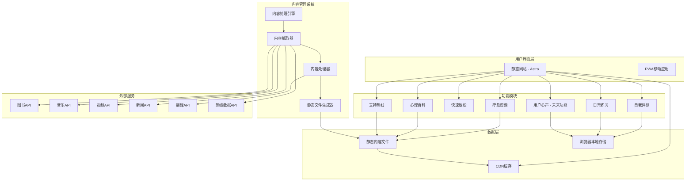

# 综合心理健康平台设计文档

## 概述

综合心理健康平台采用分层架构，将内容管理系统与静态网站分离，确保高性能、隐私保护和可扩展性。系统包含6个核心功能模块（用户心声为低优先级未来功能），通过智能内容管理系统支持动态内容，同时保持静态站点的优势。

## 系统架构

### 整体架构图



## 功能模块设计

### 1. 自我评测系统

```typescript
interface AssessmentSystem {
  // 评测类型
  assessmentTypes: AssessmentType[];
  
  // 评测执行
  startAssessment(type: AssessmentType): Assessment;
  submitAnswer(assessmentId: string, questionId: string, answer: any): void;
  completeAssessment(assessmentId: string): AssessmentResult;
  
  // 结果管理
  getAssessmentHistory(): AssessmentResult[];
  generateReport(result: AssessmentResult): AssessmentReport;
  getRecommendations(result: AssessmentResult): Recommendation[];
}

interface AssessmentType {
  id: string;
  name: string;
  description: string;
  category: 'personality' | 'mental_health' | 'stress' | 'mood';
  duration: number; // 预估完成时间（分钟）
  questions: Question[];
  scoringRules: ScoringRule[];
}

interface Question {
  id: string;
  text: string;
  type: 'single_choice' | 'multiple_choice' | 'scale' | 'text';
  options?: Option[];
  required: boolean;
  weight?: number;
}

interface AssessmentResult {
  id: string;
  assessmentType: string;
  completedAt: Date;
  scores: Record<string, number>;
  interpretation: string;
  recommendations: string[];
  riskLevel?: 'low' | 'medium' | 'high';
}

// 本地存储实现
class LocalAssessmentStorage {
  private readonly STORAGE_KEY = 'mental_health_assessments';
  
  saveResult(result: AssessmentResult): void {
    const results = this.getAllResults();
    results.push(result);
    localStorage.setItem(this.STORAGE_KEY, JSON.stringify(results));
  }
  
  getAllResults(): AssessmentResult[] {
    const data = localStorage.getItem(this.STORAGE_KEY);
    return data ? JSON.parse(data) : [];
  }
  
  getResultsByType(type: string): AssessmentResult[] {
    return this.getAllResults().filter(r => r.assessmentType === type);
  }
  
  clearAllData(): void {
    localStorage.removeItem(this.STORAGE_KEY);
  }
}
```

### 2. 日常练习系统

```typescript
interface PracticeSystem {
  // 练习类型
  practiceTypes: PracticeType[];
  
  // 练习执行
  startPractice(type: PracticeType): PracticeSession;
  pausePractice(sessionId: string): void;
  resumePractice(sessionId: string): void;
  completePractice(sessionId: string): PracticeRecord;
  
  // 历史和统计
  getPracticeHistory(): PracticeRecord[];
  getStatistics(): PracticeStatistics;
  getAchievements(): Achievement[];
}

interface PracticeType {
  id: string;
  name: string;
  description: string;
  category: 'mindfulness' | 'breathing' | 'meditation' | 'relaxation';
  duration: number; // 默认时长（分钟）
  difficulty: 'beginner' | 'intermediate' | 'advanced';
  audioGuide?: string; // 音频指导文件路径
  instructions: string[];
  benefits: string[];
}

interface PracticeSession {
  id: string;
  practiceType: string;
  startTime: Date;
  duration: number;
  status: 'active' | 'paused' | 'completed';
  currentStep: number;
  settings: {
    backgroundMusic?: string;
    volume: number;
    vibration: boolean;
  };
}

interface PracticeRecord {
  id: string;
  practiceType: string;
  completedAt: Date;
  duration: number; // 实际练习时长
  rating?: number; // 用户评分 1-5
  mood: {
    before?: MoodLevel;
    after?: MoodLevel;
  };
  notes?: string;
}

// 练习管理器实现
class PracticeManager implements PracticeSystem {
  private audioContext: AudioContext;
  private currentSession: PracticeSession | null = null;
  private storage: LocalPracticeStorage;
  
  constructor() {
    this.audioContext = new AudioContext();
    this.storage = new LocalPracticeStorage();
  }
  
  async startPractice(type: PracticeType): Promise<PracticeSession> {
    const session: PracticeSession = {
      id: this.generateId(),
      practiceType: type.id,
      startTime: new Date(),
      duration: type.duration,
      status: 'active',
      currentStep: 0,
      settings: {
        volume: 0.7,
        vibration: true
      }
    };
    
    this.currentSession = session;
    
    // 加载音频指导
    if (type.audioGuide) {
      await this.loadAudioGuide(type.audioGuide);
    }
    
    return session;
  }
  
  private async loadAudioGuide(audioPath: string): Promise<void> {
    // 实现音频加载和播放逻辑
  }
}
```

### 3. 快速放松功能

```typescript
interface RelaxationSystem {
  // 白噪音
  whiteNoiseTypes: WhiteNoiseType[];
  playWhiteNoise(type: WhiteNoiseType, settings: AudioSettings): void;
  stopWhiteNoise(): void;
  
  // 放松游戏
  relaxationGames: RelaxationGame[];
  startGame(game: RelaxationGame): void;
  
  // 呼吸练习
  breathingExercises: BreathingExercise[];
  startBreathingExercise(exercise: BreathingExercise): void;
}

interface WhiteNoiseType {
  id: string;
  name: string;
  description: string;
  audioFile: string;
  category: 'nature' | 'urban' | 'abstract';
  tags: string[];
  duration?: number; // 如果有固定时长
  loopable: boolean;
}

interface RelaxationGame {
  id: string;
  name: string;
  description: string;
  type: 'breathing_bubble' | 'color_therapy' | 'simple_puzzle' | 'zen_garden';
  difficulty: 'easy' | 'medium';
  estimatedDuration: number;
  instructions: string[];
}

interface BreathingExercise {
  id: string;
  name: string;
  description: string;
  pattern: BreathingPattern;
  duration: number;
  visualization?: string;
}

interface BreathingPattern {
  inhale: number; // 吸气秒数
  hold: number;   // 屏气秒数
  exhale: number; // 呼气秒数
  pause: number;  // 暂停秒数
}

// 白噪音播放器实现
class WhiteNoisePlayer {
  private audioContext: AudioContext;
  private currentSource: AudioBufferSourceNode | null = null;
  private gainNode: GainNode;
  private isPlaying = false;
  
  constructor() {
    this.audioContext = new AudioContext();
    this.gainNode = this.audioContext.createGain();
    this.gainNode.connect(this.audioContext.destination);
  }
  
  async play(audioFile: string, settings: AudioSettings): Promise<void> {
    if (this.isPlaying) {
      this.stop();
    }
    
    try {
      const response = await fetch(audioFile);
      const arrayBuffer = await response.arrayBuffer();
      const audioBuffer = await this.audioContext.decodeAudioData(arrayBuffer);
      
      this.currentSource = this.audioContext.createBufferSource();
      this.currentSource.buffer = audioBuffer;
      this.currentSource.loop = settings.loop || true;
      this.currentSource.connect(this.gainNode);
      
      this.gainNode.gain.value = settings.volume || 0.5;
      this.currentSource.start();
      this.isPlaying = true;
      
      // 如果设置了定时器
      if (settings.timer) {
        setTimeout(() => this.stop(), settings.timer * 60 * 1000);
      }
    } catch (error) {
      console.error('Failed to play white noise:', error);
    }
  }
  
  stop(): void {
    if (this.currentSource) {
      this.currentSource.stop();
      this.currentSource = null;
      this.isPlaying = false;
    }
  }
  
  setVolume(volume: number): void {
    this.gainNode.gain.value = Math.max(0, Math.min(1, volume));
  }
}
```

### 4. 疗愈资源展示系统

```typescript
interface ResourceSystem {
  // 资源获取
  getResources(filters: ResourceFilters): Promise<Resource[]>;
  getResourceById(id: string): Promise<Resource | null>;
  searchResources(query: string, filters?: ResourceFilters): Promise<Resource[]>;
  
  // 个性化
  getRecommendations(userProfile: UserProfile): Promise<Resource[]>;
  getFavorites(): Resource[];
  addToFavorites(resourceId: string): void;
  removeFromFavorites(resourceId: string): void;
  
  // 评分和反馈
  rateResource(resourceId: string, rating: number): void;
  getUserRating(resourceId: string): number | null;
}

interface Resource {
  id: string;
  title: string;
  description: string;
  type: 'book' | 'music' | 'video' | 'article' | 'podcast';
  language: string;
  
  // 元数据
  author?: string;
  duration?: number; // 音频/视频时长
  publishDate?: Date;
  tags: string[];
  categories: string[];
  
  // 疗愈相关
  therapeuticBenefits: string[];
  moodCategories: MoodCategory[];
  targetAudience: string[];
  difficultyLevel?: 'beginner' | 'intermediate' | 'advanced';
  
  // 访问信息
  sourceUrl: string;
  affiliateLinks?: Record<string, string>;
  availability: {
    free: boolean;
    regions: string[];
    platforms: string[];
  };
  
  // 媒体
  imageUrl?: string;
  thumbnailUrl?: string;
  previewUrl?: string; // 预览音频/视频
  
  // 统计
  qualityScore: number;
  userRating?: number;
  reviewCount?: number;
}

interface ResourceFilters {
  type?: ResourceType[];
  language?: string[];
  categories?: string[];
  moodCategories?: MoodCategory[];
  availability?: 'free' | 'paid' | 'all';
  difficultyLevel?: string[];
  minRating?: number;
  maxDuration?: number;
}

// 资源管理器实现
class ResourceManager implements ResourceSystem {
  private resources: Resource[] = [];
  private favorites: Set<string> = new Set();
  private ratings: Map<string, number> = new Map();
  
  constructor() {
    this.loadResourcesFromStaticFiles();
    this.loadUserDataFromStorage();
  }
  
  private async loadResourcesFromStaticFiles(): Promise<void> {
    try {
      // 加载各类型资源
      const [books, music, videos, articles] = await Promise.all([
        fetch('/content/resources/books.json').then(r => r.json()),
        fetch('/content/resources/music.json').then(r => r.json()),
        fetch('/content/resources/videos.json').then(r => r.json()),
        fetch('/content/resources/articles.json').then(r => r.json())
      ]);
      
      this.resources = [
        ...books.items,
        ...music.items,
        ...videos.items,
        ...articles.items
      ];
    } catch (error) {
      console.error('Failed to load resources:', error);
    }
  }
  
  async getResources(filters: ResourceFilters): Promise<Resource[]> {
    let filtered = [...this.resources];
    
    // 应用过滤器
    if (filters.type?.length) {
      filtered = filtered.filter(r => filters.type!.includes(r.type));
    }
    
    if (filters.language?.length) {
      filtered = filtered.filter(r => filters.language!.includes(r.language));
    }
    
    if (filters.categories?.length) {
      filtered = filtered.filter(r => 
        r.categories.some(cat => filters.categories!.includes(cat))
      );
    }
    
    if (filters.moodCategories?.length) {
      filtered = filtered.filter(r => 
        r.moodCategories.some(mood => filters.moodCategories!.includes(mood))
      );
    }
    
    if (filters.availability && filters.availability !== 'all') {
      filtered = filtered.filter(r => 
        filters.availability === 'free' ? r.availability.free : !r.availability.free
      );
    }
    
    if (filters.minRating) {
      filtered = filtered.filter(r => 
        (r.userRating || 0) >= filters.minRating!
      );
    }
    
    if (filters.maxDuration) {
      filtered = filtered.filter(r => 
        !r.duration || r.duration <= filters.maxDuration! * 60
      );
    }
    
    // 按质量分数和用户评分排序
    filtered.sort((a, b) => {
      const scoreA = a.qualityScore * 0.7 + (a.userRating || 0) * 0.3;
      const scoreB = b.qualityScore * 0.7 + (b.userRating || 0) * 0.3;
      return scoreB - scoreA;
    });
    
    return filtered;
  }
  
  async getRecommendations(userProfile: UserProfile): Promise<Resource[]> {
    // 基于用户评测结果、收藏历史和评分历史推荐
    const recommendations: Resource[] = [];
    
    // 1. 基于评测结果推荐
    if (userProfile.assessmentResults?.length) {
      const latestResult = userProfile.assessmentResults[0];
      const relatedResources = this.resources.filter(r => 
        r.therapeuticBenefits.some(benefit => 
          latestResult.recommendations.some(rec => 
            rec.toLowerCase().includes(benefit.toLowerCase())
          )
        )
      );
      recommendations.push(...relatedResources.slice(0, 5));
    }
    
    // 2. 基于收藏历史推荐相似内容
    const favoriteResources = this.resources.filter(r => this.favorites.has(r.id));
    if (favoriteResources.length > 0) {
      const similarResources = this.findSimilarResources(favoriteResources);
      recommendations.push(...similarResources.slice(0, 5));
    }
    
    // 3. 基于高评分内容推荐
    const highRatedResources = this.resources
      .filter(r => this.ratings.has(r.id) && this.ratings.get(r.id)! >= 4)
      .slice(0, 3);
    recommendations.push(...highRatedResources);
    
    // 去重并限制数量
    const uniqueRecommendations = Array.from(
      new Map(recommendations.map(r => [r.id, r])).values()
    );
    
    return uniqueRecommendations.slice(0, 10);
  }
  
  private findSimilarResources(favoriteResources: Resource[]): Resource[] {
    const favoriteCategories = new Set(
      favoriteResources.flatMap(r => r.categories)
    );
    const favoriteTags = new Set(
      favoriteResources.flatMap(r => r.tags)
    );
    
    return this.resources
      .filter(r => !this.favorites.has(r.id)) // 排除已收藏的
      .map(r => ({
        resource: r,
        similarity: this.calculateSimilarity(r, favoriteCategories, favoriteTags)
      }))
      .filter(item => item.similarity > 0.3)
      .sort((a, b) => b.similarity - a.similarity)
      .map(item => item.resource);
  }
  
  private calculateSimilarity(
    resource: Resource, 
    favoriteCategories: Set<string>, 
    favoriteTags: Set<string>
  ): number {
    const categoryMatches = resource.categories.filter(cat => 
      favoriteCategories.has(cat)
    ).length;
    const tagMatches = resource.tags.filter(tag => 
      favoriteTags.has(tag)
    ).length;
    
    const categoryScore = categoryMatches / Math.max(resource.categories.length, 1);
    const tagScore = tagMatches / Math.max(resource.tags.length, 1);
    
    return categoryScore * 0.6 + tagScore * 0.4;
  }
}
```

## 内容管理系统设计

### 内容分类和更新频率

```typescript
interface ContentManagementSystem {
  // 高频更新内容（每日）
  updateTherapeuticResources(): Promise<void>;
  updateMentalHealthArticles(): Promise<void>;
  updateSupportHotlines(): Promise<void>;
  
  // 中频更新内容（每周）
  updateAssessmentQuestions(): Promise<void>;
  updatePracticeContent(): Promise<void>;
  
  // 低频更新内容（手动）
  updateRelaxationContent(): Promise<void>;
  moderateUserVoices(): Promise<void>;
}

// 内容更新配置
const contentUpdateConfig = {
  therapeuticResources: {
    frequency: 'daily',
    sources: ['google-books', 'spotify', 'youtube', 'rss-feeds'],
    filters: {
      mentalHealthKeywords: [
        'mental health', 'psychology', 'therapy', 'mindfulness',
        'meditation', 'anxiety', 'depression', 'stress', 'wellness'
      ],
      qualityThreshold: 0.7,
      languageSupport: ['en', 'zh', 'ja', 'ko', 'es', 'fr', 'de']
    }
  },
  
  mentalHealthWiki: {
    frequency: 'weekly',
    sources: ['medical-journals', 'psychology-today', 'mayo-clinic'],
    contentTypes: ['articles', 'research-papers', 'guides'],
    expertReview: true
  },
  
  supportHotlines: {
    frequency: 'daily',
    sources: ['crisis-text-line', 'national-suicide-prevention', 'local-directories'],
    validation: {
      phoneNumberCheck: true,
      availabilityCheck: true,
      languageSupport: true
    }
  },
  
  assessmentTools: {
    frequency: 'manual',
    sources: ['psychology-research', 'validated-scales'],
    expertReview: true,
    qualityAssurance: {
      scientificValidation: true,
      culturalAdaptation: true,
      ethicsReview: true
    }
  }
};
```

### 静态文件生成结构

```
packages/website/src/content/
├── resources/
│   ├── en/
│   │   ├── books.json
│   │   ├── music.json
│   │   ├── videos.json
│   │   └── articles.json
│   ├── zh/
│   │   └── ...
│   └── search/
│       ├── en-index.json
│       └── zh-index.json
├── assessments/
│   ├── en/
│   │   ├── personality.json
│   │   ├── anxiety.json
│   │   ├── depression.json
│   │   └── stress.json
│   └── zh/
│       └── ...
├── practices/
│   ├── en/
│   │   ├── mindfulness.json
│   │   ├── breathing.json
│   │   └── meditation.json
│   └── zh/
│       └── ...
├── wiki/
│   ├── en/
│   │   ├── anxiety-disorders.json
│   │   ├── depression.json
│   │   └── stress-management.json
│   └── zh/
│       └── ...
├── hotlines/
│   ├── global.json
│   ├── by-country/
│   │   ├── us.json
│   │   ├── cn.json
│   │   └── ...
│   ├── emergency.json
│   └── professional-services/
│       ├── therapists.json
│       └── counselors.json
└── relaxation/
    ├── white-noise/
    │   ├── nature.json
    │   ├── urban.json
    │   └── abstract.json
    ├── games/
    │   └── relaxation-games.json
    └── breathing/
        └── exercises.json
```

## 用户数据管理

### 本地存储策略

```typescript
interface UserDataManager {
  // 评测数据
  assessmentData: {
    results: AssessmentResult[];
    preferences: AssessmentPreferences;
  };
  
  // 练习数据
  practiceData: {
    history: PracticeRecord[];
    achievements: Achievement[];
    preferences: PracticePreferences;
  };
  
  // 资源数据
  resourceData: {
    favorites: string[];
    ratings: Record<string, number>;
    viewHistory: ViewRecord[];
    recommendations: Resource[];
  };
  
  // 用户偏好
  userPreferences: {
    language: string;
    theme: 'light' | 'dark' | 'auto';
    notifications: NotificationSettings;
    privacy: PrivacySettings;
  };
  
  // 数据管理
  exportData(): string;
  importData(data: string): boolean;
  clearAllData(): void;
  getDataSize(): number;
}

// 加密存储实现
class EncryptedLocalStorage {
  private readonly ENCRYPTION_KEY = 'mental-health-platform';
  
  setItem(key: string, value: any): void {
    const encrypted = this.encrypt(JSON.stringify(value));
    localStorage.setItem(key, encrypted);
  }
  
  getItem<T>(key: string): T | null {
    const encrypted = localStorage.getItem(key);
    if (!encrypted) return null;
    
    try {
      const decrypted = this.decrypt(encrypted);
      return JSON.parse(decrypted);
    } catch {
      return null;
    }
  }
  
  private encrypt(text: string): string {
    // 简单的加密实现（生产环境应使用更强的加密）
    return btoa(text);
  }
  
  private decrypt(encrypted: string): string {
    return atob(encrypted);
  }
}
```

## 部署和运维

### GitHub Actions 工作流

```yaml
# .github/workflows/update-content.yml
name: Update Platform Content

on:
  schedule:
    # 每日更新疗愈资源和支持热线
    - cron: '0 2 * * *'
    # 每周更新评测和练习内容
    - cron: '0 3 * * 1'
  workflow_dispatch:
    inputs:
      content_type:
        description: 'Content type to update'
        required: true
        default: 'all'
        type: choice
        options:
        - all
        - resources
        - wiki
        - hotlines
        - assessments
        - practices

jobs:
  update-content:
    runs-on: ubuntu-latest
    steps:
      - uses: actions/checkout@v3
      
      - name: Setup Node.js
        uses: actions/setup-node@v3
        with:
          node-version: '18'
          cache: 'npm'
      
      - name: Install dependencies
        run: npm ci
      
      - name: Update therapeutic resources
        if: github.event.inputs.content_type == 'all' || github.event.inputs.content_type == 'resources'
        env:
          GOOGLE_BOOKS_API_KEY: ${{ secrets.GOOGLE_BOOKS_API_KEY }}
          SPOTIFY_CLIENT_ID: ${{ secrets.SPOTIFY_CLIENT_ID }}
          SPOTIFY_CLIENT_SECRET: ${{ secrets.SPOTIFY_CLIENT_SECRET }}
          YOUTUBE_API_KEY: ${{ secrets.YOUTUBE_API_KEY }}
        run: |
          cd packages/content-fetcher
          npm run update:resources
      
      - name: Update mental health wiki
        if: github.event.inputs.content_type == 'all' || github.event.inputs.content_type == 'wiki'
        env:
          NEWS_API_KEY: ${{ secrets.NEWS_API_KEY }}
        run: |
          cd packages/content-fetcher
          npm run update:wiki
      
      - name: Update support hotlines
        if: github.event.inputs.content_type == 'all' || github.event.inputs.content_type == 'hotlines'
        run: |
          cd packages/content-fetcher
          npm run update:hotlines
      
      - name: Validate content quality
        run: |
          cd packages/content-fetcher
          npm run validate:content
      
      - name: Generate search indices
        run: |
          cd packages/content-fetcher
          npm run generate:search-index
      
      - name: Commit and push changes
        uses: stefanzweifel/git-auto-commit-action@v4
        with:
          commit_message: 'chore: update platform content'
          file_pattern: 'packages/website/src/content/'
```

这个重新设计的系统更好地平衡了内容管理的自动化需求和网站功能的复杂性，明确了各个模块的职责和数据流向。
