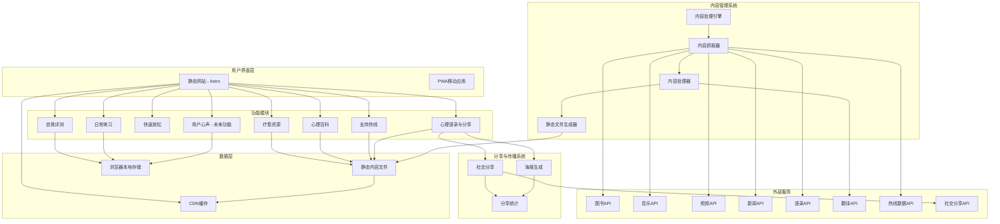

# 综合心理健康平台设计文档

## 概述

综合心理健康平台采用分层架构，将内容管理系统与静态网站分离，确保高性能、隐私保护和可扩展性。系统包含7个核心功能模块，通过智能内容管理系统支持动态内容，同时保持静态站点的优势。平台特别注重内容分享和传播功能，通过心理语录分享和精美海报生成来提升影响力和流量。

**注意：** 所有用户身份相关功能（如个性化推荐、评论、用户画像等）统一作为未来功能，与「用户心声」一起考虑。当前版本专注于内容展示和分享功能。

**重点功能：** 心理语录分享和海报生成是平台的核心传播功能，旨在：
- 提升网站影响力和品牌认知度
- 增加自然流量和用户获取
- 通过精美的视觉内容在社交媒体上传播正能量
- 建立用户与平台的情感连接
- 支持多平台分享以最大化传播效果

## 系统架构

### 整体架构图



## 功能模块设计

### 1. 自我评测系统

```typescript
interface AssessmentSystem {
  // 评测类型
  assessmentTypes: AssessmentType[];
  
  // 评测执行
  startAssessment(type: AssessmentType): Assessment;
  submitAnswer(assessmentId: string, questionId: string, answer: any): void;
  completeAssessment(assessmentId: string): AssessmentResult;
  
  // 结果管理
  getAssessmentHistory(): AssessmentResult[];
  generateReport(result: AssessmentResult): AssessmentReport;
  getRecommendations(result: AssessmentResult): Recommendation[];
}

interface AssessmentType {
  id: string;
  name: string;
  description: string;
  category: 'personality' | 'mental_health' | 'stress' | 'mood';
  duration: number; // 预估完成时间（分钟）
  questions: Question[];
  scoringRules: ScoringRule[];
}

interface Question {
  id: string;
  text: string;
  type: 'single_choice' | 'multiple_choice' | 'scale' | 'text';
  options?: Option[];
  required: boolean;
  weight?: number;
}

interface AssessmentResult {
  id: string;
  assessmentType: string;
  completedAt: Date;
  scores: Record<string, number>;
  interpretation: string;
  recommendations: string[];
  riskLevel?: 'low' | 'medium' | 'high';
}

// 本地存储实现
class LocalAssessmentStorage {
  private readonly STORAGE_KEY = 'mental_health_assessments';
  
  saveResult(result: AssessmentResult): void {
    const results = this.getAllResults();
    results.push(result);
    localStorage.setItem(this.STORAGE_KEY, JSON.stringify(results));
  }
  
  getAllResults(): AssessmentResult[] {
    const data = localStorage.getItem(this.STORAGE_KEY);
    return data ? JSON.parse(data) : [];
  }
  
  getResultsByType(type: string): AssessmentResult[] {
    return this.getAllResults().filter(r => r.assessmentType === type);
  }
  
  clearAllData(): void {
    localStorage.removeItem(this.STORAGE_KEY);
  }
}
```

### 2. 日常练习系统

```typescript
interface PracticeSystem {
  // 练习类型
  practiceTypes: PracticeType[];
  
  // 练习执行
  startPractice(type: PracticeType): PracticeSession;
  pausePractice(sessionId: string): void;
  resumePractice(sessionId: string): void;
  completePractice(sessionId: string): PracticeRecord;
  
  // 历史和统计
  getPracticeHistory(): PracticeRecord[];
  getStatistics(): PracticeStatistics;
  getAchievements(): Achievement[];
}

interface PracticeType {
  id: string;
  name: string;
  description: string;
  category: 'mindfulness' | 'breathing' | 'meditation' | 'relaxation';
  duration: number; // 默认时长（分钟）
  difficulty: 'beginner' | 'intermediate' | 'advanced';
  audioGuide?: string; // 音频指导文件路径
  instructions: string[];
  benefits: string[];
}

interface PracticeSession {
  id: string;
  practiceType: string;
  startTime: Date;
  duration: number;
  status: 'active' | 'paused' | 'completed';
  currentStep: number;
  settings: {
    backgroundMusic?: string;
    volume: number;
    vibration: boolean;
  };
}

interface PracticeRecord {
  id: string;
  practiceType: string;
  completedAt: Date;
  duration: number; // 实际练习时长
  rating?: number; // 用户评分 1-5
  mood: {
    before?: MoodLevel;
    after?: MoodLevel;
  };
  notes?: string;
}

// 练习管理器实现
class PracticeManager implements PracticeSystem {
  private audioContext: AudioContext;
  private currentSession: PracticeSession | null = null;
  private storage: LocalPracticeStorage;
  
  constructor() {
    this.audioContext = new AudioContext();
    this.storage = new LocalPracticeStorage();
  }
  
  async startPractice(type: PracticeType): Promise<PracticeSession> {
    const session: PracticeSession = {
      id: this.generateId(),
      practiceType: type.id,
      startTime: new Date(),
      duration: type.duration,
      status: 'active',
      currentStep: 0,
      settings: {
        volume: 0.7,
        vibration: true
      }
    };
    
    this.currentSession = session;
    
    // 加载音频指导
    if (type.audioGuide) {
      await this.loadAudioGuide(type.audioGuide);
    }
    
    return session;
  }
  
  private async loadAudioGuide(audioPath: string): Promise<void> {
    // 实现音频加载和播放逻辑
  }
}
```

### 3. 快速放松功能

```typescript
interface RelaxationSystem {
  // 白噪音
  whiteNoiseTypes: WhiteNoiseType[];
  playWhiteNoise(type: WhiteNoiseType, settings: AudioSettings): void;
  stopWhiteNoise(): void;
  
  // 放松游戏
  relaxationGames: RelaxationGame[];
  startGame(game: RelaxationGame): void;
  
  // 呼吸练习
  breathingExercises: BreathingExercise[];
  startBreathingExercise(exercise: BreathingExercise): void;
}

interface WhiteNoiseType {
  id: string;
  name: string;
  description: string;
  audioFile: string;
  category: 'nature' | 'urban' | 'abstract';
  tags: string[];
  duration?: number; // 如果有固定时长
  loopable: boolean;
}

interface RelaxationGame {
  id: string;
  name: string;
  description: string;
  type: 'breathing_bubble' | 'color_therapy' | 'simple_puzzle' | 'zen_garden';
  difficulty: 'easy' | 'medium';
  estimatedDuration: number;
  instructions: string[];
}

interface BreathingExercise {
  id: string;
  name: string;
  description: string;
  pattern: BreathingPattern;
  duration: number;
  visualization?: string;
}

interface BreathingPattern {
  inhale: number; // 吸气秒数
  hold: number;   // 屏气秒数
  exhale: number; // 呼气秒数
  pause: number;  // 暂停秒数
}

// 白噪音播放器实现
class WhiteNoisePlayer {
  private audioContext: AudioContext;
  private currentSource: AudioBufferSourceNode | null = null;
  private gainNode: GainNode;
  private isPlaying = false;
  
  constructor() {
    this.audioContext = new AudioContext();
    this.gainNode = this.audioContext.createGain();
    this.gainNode.connect(this.audioContext.destination);
  }
  
  async play(audioFile: string, settings: AudioSettings): Promise<void> {
    if (this.isPlaying) {
      this.stop();
    }
    
    try {
      const response = await fetch(audioFile);
      const arrayBuffer = await response.arrayBuffer();
      const audioBuffer = await this.audioContext.decodeAudioData(arrayBuffer);
      
      this.currentSource = this.audioContext.createBufferSource();
      this.currentSource.buffer = audioBuffer;
      this.currentSource.loop = settings.loop || true;
      this.currentSource.connect(this.gainNode);
      
      this.gainNode.gain.value = settings.volume || 0.5;
      this.currentSource.start();
      this.isPlaying = true;
      
      // 如果设置了定时器
      if (settings.timer) {
        setTimeout(() => this.stop(), settings.timer * 60 * 1000);
      }
    } catch (error) {
      console.error('Failed to play white noise:', error);
    }
  }
  
  stop(): void {
    if (this.currentSource) {
      this.currentSource.stop();
      this.currentSource = null;
      this.isPlaying = false;
    }
  }
  
  setVolume(volume: number): void {
    this.gainNode.gain.value = Math.max(0, Math.min(1, volume));
  }
}
```

### 4. 疗愈资源展示系统

```typescript
interface ResourceSystem {
  // 资源获取
  getResources(filters: ResourceFilters): Promise<Resource[]>;
  getResourceById(id: string): Promise<Resource | null>;
  searchResources(query: string, filters?: ResourceFilters): Promise<Resource[]>;
  
  // 基础功能（无用户身份）
  getFavorites(): Resource[]; // 本地存储
  addToFavorites(resourceId: string): void;
  removeFromFavorites(resourceId: string): void;
  
  // 分享功能
  shareResource(resourceId: string, platform: SharePlatform): Promise<ShareResult>;
  generateResourcePoster(resourceId: string, template: PosterTemplate): Promise<string>;
}

interface Resource {
  id: string;
  title: string;
  description: string;
  type: 'book' | 'music' | 'video' | 'article' | 'podcast';
  language: string;
  
  // 元数据
  author?: string;
  duration?: number; // 音频/视频时长
  publishDate?: Date;
  tags: string[];
  categories: string[];
  
  // 疗愈相关
  therapeuticBenefits: string[];
  moodCategories: MoodCategory[];
  targetAudience: string[];
  difficultyLevel?: 'beginner' | 'intermediate' | 'advanced';
  
  // 访问信息
  sourceUrl: string;
  affiliateLinks?: Record<string, string>;
  availability: {
    free: boolean;
    regions: string[];
    platforms: string[];
  };
  
  // 媒体
  imageUrl?: string;
  thumbnailUrl?: string;
  previewUrl?: string; // 预览音频/视频
  
  // 统计
  qualityScore: number;
  viewCount?: number;
  shareCount?: number;
}

interface ResourceFilters {
  type?: ResourceType[];
  language?: string[];
  categories?: string[];
  moodCategories?: MoodCategory[];
  availability?: 'free' | 'paid' | 'all';
  difficultyLevel?: string[];
  maxDuration?: number;
  sortBy?: 'quality' | 'date' | 'popularity';
}

// 资源管理器实现
class ResourceManager implements ResourceSystem {
  private resources: Resource[] = [];
  private favorites: Set<string> = new Set();
  
  constructor() {
    this.loadResourcesFromStaticFiles();
    this.loadUserDataFromStorage();
  }
  
  private async loadResourcesFromStaticFiles(): Promise<void> {
    try {
      // 加载各类型资源
      const [books, music, videos, articles] = await Promise.all([
        fetch('/content/resources/books.json').then(r => r.json()),
        fetch('/content/resources/music.json').then(r => r.json()),
        fetch('/content/resources/videos.json').then(r => r.json()),
        fetch('/content/resources/articles.json').then(r => r.json())
      ]);
      
      this.resources = [
        ...books.items,
        ...music.items,
        ...videos.items,
        ...articles.items
      ];
    } catch (error) {
      console.error('Failed to load resources:', error);
    }
  }
  
  async getResources(filters: ResourceFilters): Promise<Resource[]> {
    let filtered = [...this.resources];
    
    // 应用过滤器
    if (filters.type?.length) {
      filtered = filtered.filter(r => filters.type!.includes(r.type));
    }
    
    if (filters.language?.length) {
      filtered = filtered.filter(r => filters.language!.includes(r.language));
    }
    
    if (filters.categories?.length) {
      filtered = filtered.filter(r => 
        r.categories.some(cat => filters.categories!.includes(cat))
      );
    }
    
    if (filters.moodCategories?.length) {
      filtered = filtered.filter(r => 
        r.moodCategories.some(mood => filters.moodCategories!.includes(mood))
      );
    }
    
    if (filters.availability && filters.availability !== 'all') {
      filtered = filtered.filter(r => 
        filters.availability === 'free' ? r.availability.free : !r.availability.free
      );
    }
    
    if (filters.maxDuration) {
      filtered = filtered.filter(r => 
        !r.duration || r.duration <= filters.maxDuration! * 60
      );
    }
    
    // 排序
    filtered.sort((a, b) => {
      switch (filters.sortBy) {
        case 'date':
          return (b.publishDate?.getTime() || 0) - (a.publishDate?.getTime() || 0);
        case 'popularity':
          return (b.shareCount || 0) - (a.shareCount || 0);
        case 'quality':
        default:
          return b.qualityScore - a.qualityScore;
      }
    });
    
    return filtered;
  }
  
  async shareResource(resourceId: string, platform: SharePlatform): Promise<ShareResult> {
    const resource = this.resources.find(r => r.id === resourceId);
    if (!resource) {
      throw new Error('Resource not found');
    }
    
    const shareData = {
      title: resource.title,
      text: resource.description,
      url: `${window.location.origin}/resources/${resourceId}`
    };
    
    try {
      if (navigator.share && platform === 'native') {
        await navigator.share(shareData);
        return { success: true, platform: 'native' };
      } else {
        // 使用平台特定的分享URL
        const shareUrl = this.generateShareUrl(platform, shareData);
        window.open(shareUrl, '_blank');
        return { success: true, platform, url: shareUrl };
      }
    } catch (error) {
      return { success: false, error: error.message };
    }
  }
  
  async generateResourcePoster(resourceId: string, template: PosterTemplate): Promise<string> {
    const resource = this.resources.find(r => r.id === resourceId);
    if (!resource) {
      throw new Error('Resource not found');
    }
    
    // 使用Canvas API生成海报
    const canvas = document.createElement('canvas');
    const ctx = canvas.getContext('2d')!;
    
    // 设置画布尺寸
    canvas.width = template.width;
    canvas.height = template.height;
    
    // 绘制背景
    ctx.fillStyle = template.backgroundColor;
    ctx.fillRect(0, 0, canvas.width, canvas.height);
    
    // 绘制标题
    ctx.fillStyle = template.textColor;
    ctx.font = `${template.titleFontSize}px ${template.fontFamily}`;
    ctx.textAlign = 'center';
    ctx.fillText(resource.title, canvas.width / 2, template.titleY);
    
    // 绘制描述
    ctx.font = `${template.descriptionFontSize}px ${template.fontFamily}`;
    const words = resource.description.split(' ');
    let line = '';
    let y = template.descriptionY;
    
    for (const word of words) {
      const testLine = line + word + ' ';
      const metrics = ctx.measureText(testLine);
      if (metrics.width > template.maxTextWidth && line !== '') {
        ctx.fillText(line, canvas.width / 2, y);
        line = word + ' ';
        y += template.lineHeight;
      } else {
        line = testLine;
      }
    }
    ctx.fillText(line, canvas.width / 2, y);
    
    // 添加网站标识
    ctx.font = `${template.brandFontSize}px ${template.fontFamily}`;
    ctx.fillText(template.brandText, canvas.width / 2, canvas.height - template.brandMargin);
    
    return canvas.toDataURL('image/png');
  }
  
  private generateShareUrl(platform: SharePlatform, data: ShareData): string {
    const encodedUrl = encodeURIComponent(data.url);
    const encodedText = encodeURIComponent(data.text);
    const encodedTitle = encodeURIComponent(data.title);
    
    switch (platform) {
      case 'twitter':
        return `https://twitter.com/intent/tweet?text=${encodedText}&url=${encodedUrl}`;
      case 'facebook':
        return `https://www.facebook.com/sharer/sharer.php?u=${encodedUrl}`;
      case 'linkedin':
        return `https://www.linkedin.com/sharing/share-offsite/?url=${encodedUrl}`;
      case 'whatsapp':
        return `https://wa.me/?text=${encodedText}%20${encodedUrl}`;
      case 'telegram':
        return `https://t.me/share/url?url=${encodedUrl}&text=${encodedText}`;
      default:
        return data.url;
    }
  }
}

// 分享相关接口
interface ShareData {
  title: string;
  text: string;
  url: string;
}

interface ShareResult {
  success: boolean;
  platform?: SharePlatform;
  url?: string;
  error?: string;
}

type SharePlatform = 'native' | 'twitter' | 'facebook' | 'linkedin' | 'whatsapp' | 'telegram';

interface PosterTemplate {
  width: number;
  height: number;
  backgroundColor: string;
  textColor: string;
  fontFamily: string;
  titleFontSize: number;
  titleY: number;
  descriptionFontSize: number;
  descriptionY: number;
  maxTextWidth: number;
  lineHeight: number;
  brandText: string;
  brandFontSize: number;
  brandMargin: number;
}
```

### 5. 心理语录与分享系统

```typescript
interface QuoteSystem {
  // 语录获取
  getQuotes(filters: QuoteFilters): Promise<Quote[]>;
  getQuoteById(id: string): Promise<Quote | null>;
  getRandomQuote(category?: QuoteCategory): Promise<Quote>;
  getDailyQuote(): Promise<Quote>;
  
  // 分享功能
  shareQuote(quoteId: string, platform: SharePlatform): Promise<ShareResult>;
  generateQuotePoster(quoteId: string, template: QuotePosterTemplate): Promise<string>;
  
  // 统计功能
  trackShare(quoteId: string, platform: SharePlatform): void;
  getPopularQuotes(timeframe: 'day' | 'week' | 'month'): Promise<Quote[]>;
}

interface Quote {
  id: string;
  text: string;
  author?: string;
  source?: string;
  category: QuoteCategory;
  tags: string[];
  language: string;
  
  // 情感属性
  mood: MoodCategory;
  therapeuticBenefit: string[];
  targetAudience: string[];
  
  // 统计数据
  shareCount: number;
  viewCount: number;
  createdAt: Date;
  
  // 媒体
  backgroundImage?: string;
  audioUrl?: string; // 语音朗读
}

type QuoteCategory = 'motivation' | 'healing' | 'mindfulness' | 'self-love' | 'resilience' | 'hope' | 'wisdom' | 'gratitude';

interface QuoteFilters {
  category?: QuoteCategory[];
  mood?: MoodCategory[];
  language?: string;
  hasAudio?: boolean;
  sortBy?: 'popular' | 'recent' | 'random';
}

interface QuotePosterTemplate {
  id: string;
  name: string;
  width: number;
  height: number;
  
  // 背景设计
  backgroundType: 'color' | 'gradient' | 'image';
  backgroundColor?: string;
  gradientColors?: string[];
  backgroundImage?: string;
  
  // 文字样式
  textColor: string;
  fontFamily: string;
  fontSize: number;
  textAlign: 'left' | 'center' | 'right';
  textPosition: { x: number; y: number };
  maxTextWidth: number;
  lineHeight: number;
  
  // 作者样式
  authorColor: string;
  authorFontSize: number;
  authorPosition: { x: number; y: number };
  
  // 品牌标识
  brandText: string;
  brandColor: string;
  brandFontSize: number;
  brandPosition: { x: number; y: number };
  
  // 装饰元素
  decorativeElements?: {
    type: 'quote-marks' | 'border' | 'pattern';
    color: string;
    position: { x: number; y: number };
    size: number;
  }[];
}

// 语录管理器实现
class QuoteManager implements QuoteSystem {
  private quotes: Quote[] = [];
  private shareStats: Map<string, number> = new Map();
  
  constructor() {
    this.loadQuotesFromStaticFiles();
  }
  
  private async loadQuotesFromStaticFiles(): Promise<void> {
    try {
      const response = await fetch('/content/quotes/quotes.json');
      const data = await response.json();
      this.quotes = data.quotes;
    } catch (error) {
      console.error('Failed to load quotes:', error);
    }
  }
  
  async getQuotes(filters: QuoteFilters): Promise<Quote[]> {
    let filtered = [...this.quotes];
    
    if (filters.category?.length) {
      filtered = filtered.filter(q => filters.category!.includes(q.category));
    }
    
    if (filters.mood?.length) {
      filtered = filtered.filter(q => filters.mood!.includes(q.mood));
    }
    
    if (filters.language) {
      filtered = filtered.filter(q => q.language === filters.language);
    }
    
    if (filters.hasAudio !== undefined) {
      filtered = filtered.filter(q => !!q.audioUrl === filters.hasAudio);
    }
    
    // 排序
    switch (filters.sortBy) {
      case 'popular':
        filtered.sort((a, b) => b.shareCount - a.shareCount);
        break;
      case 'recent':
        filtered.sort((a, b) => b.createdAt.getTime() - a.createdAt.getTime());
        break;
      case 'random':
        filtered = this.shuffleArray(filtered);
        break;
    }
    
    return filtered;
  }
  
  async getRandomQuote(category?: QuoteCategory): Promise<Quote> {
    let availableQuotes = this.quotes;
    
    if (category) {
      availableQuotes = this.quotes.filter(q => q.category === category);
    }
    
    const randomIndex = Math.floor(Math.random() * availableQuotes.length);
    return availableQuotes[randomIndex];
  }
  
  async getDailyQuote(): Promise<Quote> {
    // 基于日期生成固定的每日语录
    const today = new Date();
    const dayOfYear = Math.floor((today.getTime() - new Date(today.getFullYear(), 0, 0).getTime()) / 86400000);
    const index = dayOfYear % this.quotes.length;
    return this.quotes[index];
  }
  
  async shareQuote(quoteId: string, platform: SharePlatform): Promise<ShareResult> {
    const quote = this.quotes.find(q => q.id === quoteId);
    if (!quote) {
      throw new Error('Quote not found');
    }
    
    const shareText = `"${quote.text}"${quote.author ? ` - ${quote.author}` : ''}`;
    const shareData = {
      title: '心理健康语录',
      text: shareText,
      url: `${window.location.origin}/quotes/${quoteId}`
    };
    
    try {
      if (navigator.share && platform === 'native') {
        await navigator.share(shareData);
        this.trackShare(quoteId, platform);
        return { success: true, platform: 'native' };
      } else {
        const shareUrl = this.generateShareUrl(platform, shareData);
        window.open(shareUrl, '_blank');
        this.trackShare(quoteId, platform);
        return { success: true, platform, url: shareUrl };
      }
    } catch (error) {
      return { success: false, error: error.message };
    }
  }
  
  async generateQuotePoster(quoteId: string, template: QuotePosterTemplate): Promise<string> {
    const quote = this.quotes.find(q => q.id === quoteId);
    if (!quote) {
      throw new Error('Quote not found');
    }
    
    const canvas = document.createElement('canvas');
    const ctx = canvas.getContext('2d')!;
    
    canvas.width = template.width;
    canvas.height = template.height;
    
    // 绘制背景
    await this.drawBackground(ctx, template);
    
    // 绘制装饰元素
    this.drawDecorations(ctx, template);
    
    // 绘制语录文本
    this.drawQuoteText(ctx, quote.text, template);
    
    // 绘制作者
    if (quote.author) {
      this.drawAuthor(ctx, quote.author, template);
    }
    
    // 绘制品牌标识
    this.drawBrand(ctx, template);
    
    return canvas.toDataURL('image/png');
  }
  
  trackShare(quoteId: string, platform: SharePlatform): void {
    const currentCount = this.shareStats.get(quoteId) || 0;
    this.shareStats.set(quoteId, currentCount + 1);
    
    // 更新语录的分享计数
    const quote = this.quotes.find(q => q.id === quoteId);
    if (quote) {
      quote.shareCount++;
    }
    
    // 发送分析数据（如果有分析服务）
    this.sendAnalytics('quote_shared', {
      quoteId,
      platform,
      timestamp: new Date().toISOString()
    });
  }
  
  async getPopularQuotes(timeframe: 'day' | 'week' | 'month'): Promise<Quote[]> {
    // 在实际实现中，这里会查询分析数据
    // 现在返回按分享数排序的语录
    return [...this.quotes]
      .sort((a, b) => b.shareCount - a.shareCount)
      .slice(0, 10);
  }
  
  private async drawBackground(ctx: CanvasRenderingContext2D, template: QuotePosterTemplate): Promise<void> {
    switch (template.backgroundType) {
      case 'color':
        ctx.fillStyle = template.backgroundColor!;
        ctx.fillRect(0, 0, template.width, template.height);
        break;
      case 'gradient':
        const gradient = ctx.createLinearGradient(0, 0, 0, template.height);
        template.gradientColors!.forEach((color, index) => {
          gradient.addColorStop(index / (template.gradientColors!.length - 1), color);
        });
        ctx.fillStyle = gradient;
        ctx.fillRect(0, 0, template.width, template.height);
        break;
      case 'image':
        if (template.backgroundImage) {
          const img = new Image();
          await new Promise((resolve) => {
            img.onload = resolve;
            img.src = template.backgroundImage!;
          });
          ctx.drawImage(img, 0, 0, template.width, template.height);
        }
        break;
    }
  }
  
  private drawQuoteText(ctx: CanvasRenderingContext2D, text: string, template: QuotePosterTemplate): void {
    ctx.fillStyle = template.textColor;
    ctx.font = `${template.fontSize}px ${template.fontFamily}`;
    ctx.textAlign = template.textAlign;
    
    const words = text.split(' ');
    let line = '';
    let y = template.textPosition.y;
    
    for (const word of words) {
      const testLine = line + word + ' ';
      const metrics = ctx.measureText(testLine);
      if (metrics.width > template.maxTextWidth && line !== '') {
        ctx.fillText(line, template.textPosition.x, y);
        line = word + ' ';
        y += template.lineHeight;
      } else {
        line = testLine;
      }
    }
    ctx.fillText(line, template.textPosition.x, y);
  }
  
  private drawAuthor(ctx: CanvasRenderingContext2D, author: string, template: QuotePosterTemplate): void {
    ctx.fillStyle = template.authorColor;
    ctx.font = `${template.authorFontSize}px ${template.fontFamily}`;
    ctx.textAlign = 'right';
    ctx.fillText(`— ${author}`, template.authorPosition.x, template.authorPosition.y);
  }
  
  private drawBrand(ctx: CanvasRenderingContext2D, template: QuotePosterTemplate): void {
    ctx.fillStyle = template.brandColor;
    ctx.font = `${template.brandFontSize}px ${template.fontFamily}`;
    ctx.textAlign = 'center';
    ctx.fillText(template.brandText, template.brandPosition.x, template.brandPosition.y);
  }
  
  private drawDecorations(ctx: CanvasRenderingContext2D, template: QuotePosterTemplate): void {
    if (!template.decorativeElements) return;
    
    for (const element of template.decorativeElements) {
      ctx.fillStyle = element.color;
      
      switch (element.type) {
        case 'quote-marks':
          ctx.font = `${element.size}px serif`;
          ctx.fillText('"', element.position.x, element.position.y);
          break;
        case 'border':
          ctx.strokeStyle = element.color;
          ctx.lineWidth = 2;
          ctx.strokeRect(10, 10, template.width - 20, template.height - 20);
          break;
      }
    }
  }
  
  private shuffleArray<T>(array: T[]): T[] {
    const shuffled = [...array];
    for (let i = shuffled.length - 1; i > 0; i--) {
      const j = Math.floor(Math.random() * (i + 1));
      [shuffled[i], shuffled[j]] = [shuffled[j], shuffled[i]];
    }
    return shuffled;
  }
  
  private generateShareUrl(platform: SharePlatform, data: ShareData): string {
    const encodedUrl = encodeURIComponent(data.url);
    const encodedText = encodeURIComponent(data.text);
    
    switch (platform) {
      case 'twitter':
        return `https://twitter.com/intent/tweet?text=${encodedText}&url=${encodedUrl}`;
      case 'facebook':
        return `https://www.facebook.com/sharer/sharer.php?u=${encodedUrl}`;
      case 'linkedin':
        return `https://www.linkedin.com/sharing/share-offsite/?url=${encodedUrl}`;
      case 'whatsapp':
        return `https://wa.me/?text=${encodedText}%20${encodedUrl}`;
      case 'telegram':
        return `https://t.me/share/url?url=${encodedUrl}&text=${encodedText}`;
      default:
        return data.url;
    }
  }
  
  private sendAnalytics(event: string, data: any): void {
    // 发送到分析服务（如Google Analytics, Plausible等）
    if (typeof gtag !== 'undefined') {
      gtag('event', event, data);
    }
  }
}
```

## 内容管理系统设计

### 内容分类和更新频率

```typescript
interface ContentManagementSystem {
  // 高频更新内容（每日）
  updateTherapeuticResources(): Promise<void>;
  updateMentalHealthArticles(): Promise<void>;
  updateSupportHotlines(): Promise<void>;
  
  // 中频更新内容（每周）
  updateAssessmentQuestions(): Promise<void>;
  updatePracticeContent(): Promise<void>;
  
  // 低频更新内容（手动）
  updateRelaxationContent(): Promise<void>;
  moderateUserVoices(): Promise<void>;
}

// 内容更新配置
const contentUpdateConfig = {
  therapeuticResources: {
    frequency: 'daily',
    sources: ['google-books', 'spotify', 'youtube', 'rss-feeds'],
    filters: {
      mentalHealthKeywords: [
        'mental health', 'psychology', 'therapy', 'mindfulness',
        'meditation', 'anxiety', 'depression', 'stress', 'wellness'
      ],
      qualityThreshold: 0.7,
      languageSupport: ['en', 'zh', 'ja', 'ko', 'es', 'fr', 'de']
    }
  },
  
  mentalHealthWiki: {
    frequency: 'weekly',
    sources: ['medical-journals', 'psychology-today', 'mayo-clinic'],
    contentTypes: ['articles', 'research-papers', 'guides'],
    expertReview: true
  },
  
  supportHotlines: {
    frequency: 'daily',
    sources: ['crisis-text-line', 'national-suicide-prevention', 'local-directories'],
    validation: {
      phoneNumberCheck: true,
      availabilityCheck: true,
      languageSupport: true
    }
  },
  
  mentalHealthQuotes: {
    frequency: 'weekly',
    sources: ['goodreads-quotes', 'brainyquote', 'psychology-quotes', 'curated-collections'],
    categories: ['motivation', 'healing', 'mindfulness', 'self-love', 'resilience', 'hope'],
    filters: {
      mentalHealthRelevance: true,
      positiveMessage: true,
      appropriateLength: { min: 10, max: 280 },
      languageSupport: ['en', 'zh']
    },
    qualityAssurance: {
      duplicateDetection: true,
      sentimentAnalysis: true,
      culturalSensitivity: true
    }
  },
  
  assessmentTools: {
    frequency: 'manual',
    sources: ['psychology-research', 'validated-scales'],
    expertReview: true,
    qualityAssurance: {
      scientificValidation: true,
      culturalAdaptation: true,
      ethicsReview: true
    }
  }
};
```

### 静态文件生成结构

```
packages/website/src/content/
├── resources/
│   ├── en/
│   │   ├── books.json
│   │   ├── music.json
│   │   ├── videos.json
│   │   └── articles.json
│   ├── zh/
│   │   └── ...
│   └── search/
│       ├── en-index.json
│       └── zh-index.json
├── quotes/
│   ├── en/
│   │   ├── quotes.json
│   │   ├── daily-quotes.json
│   │   └── categories/
│   │       ├── motivation.json
│   │       ├── healing.json
│   │       ├── mindfulness.json
│   │       └── ...
│   ├── zh/
│   │   └── ...
│   ├── templates/
│   │   ├── poster-templates.json
│   │   └── backgrounds/
│   └── analytics/
│       ├── popular-quotes.json
│       └── share-stats.json
├── assessments/
│   ├── en/
│   │   ├── personality.json
│   │   ├── anxiety.json
│   │   ├── depression.json
│   │   └── stress.json
│   └── zh/
│       └── ...
├── practices/
│   ├── en/
│   │   ├── mindfulness.json
│   │   ├── breathing.json
│   │   └── meditation.json
│   └── zh/
│       └── ...
├── wiki/
│   ├── en/
│   │   ├── anxiety-disorders.json
│   │   ├── depression.json
│   │   └── stress-management.json
│   └── zh/
│       └── ...
├── hotlines/
│   ├── global.json
│   ├── by-country/
│   │   ├── us.json
│   │   ├── cn.json
│   │   └── ...
│   ├── emergency.json
│   └── professional-services/
│       ├── therapists.json
│       └── counselors.json
└── relaxation/
    ├── white-noise/
    │   ├── nature.json
    │   ├── urban.json
    │   └── abstract.json
    ├── games/
    │   └── relaxation-games.json
    └── breathing/
        └── exercises.json
```

## 用户数据管理

### 本地存储策略

```typescript
interface UserDataManager {
  // 评测数据
  assessmentData: {
    results: AssessmentResult[];
    preferences: AssessmentPreferences;
  };
  
  // 练习数据
  practiceData: {
    history: PracticeRecord[];
    achievements: Achievement[];
    preferences: PracticePreferences;
  };
  
  // 资源数据
  resourceData: {
    favorites: string[];
    viewHistory: ViewRecord[];
  };
  
  // 语录数据
  quoteData: {
    favorites: string[];
    shareHistory: ShareRecord[];
    viewHistory: ViewRecord[];
  };
  
  // 用户偏好
  userPreferences: {
    language: string;
    theme: 'light' | 'dark' | 'auto';
    notifications: NotificationSettings;
    privacy: PrivacySettings;
  };
  
  // 数据管理
  exportData(): string;
  importData(data: string): boolean;
  clearAllData(): void;
  getDataSize(): number;
}

// 加密存储实现
class EncryptedLocalStorage {
  private readonly ENCRYPTION_KEY = 'mental-health-platform';
  
  setItem(key: string, value: any): void {
    const encrypted = this.encrypt(JSON.stringify(value));
    localStorage.setItem(key, encrypted);
  }
  
  getItem<T>(key: string): T | null {
    const encrypted = localStorage.getItem(key);
    if (!encrypted) return null;
    
    try {
      const decrypted = this.decrypt(encrypted);
      return JSON.parse(decrypted);
    } catch {
      return null;
    }
  }
  
  private encrypt(text: string): string {
    // 简单的加密实现（生产环境应使用更强的加密）
    return btoa(text);
  }
  
  private decrypt(encrypted: string): string {
    return atob(encrypted);
  }
}
```

## 部署和运维

### GitHub Actions 工作流

```yaml
# .github/workflows/update-content.yml
name: Update Platform Content

on:
  schedule:
    # 每日更新疗愈资源和支持热线
    - cron: '0 2 * * *'
    # 每周更新评测和练习内容
    - cron: '0 3 * * 1'
  workflow_dispatch:
    inputs:
      content_type:
        description: 'Content type to update'
        required: true
        default: 'all'
        type: choice
        options:
        - all
        - resources
        - wiki
        - hotlines
        - quotes
        - assessments
        - practices

jobs:
  update-content:
    runs-on: ubuntu-latest
    steps:
      - uses: actions/checkout@v3
      
      - name: Setup Node.js
        uses: actions/setup-node@v3
        with:
          node-version: '18'
          cache: 'npm'
      
      - name: Install dependencies
        run: npm ci
      
      - name: Update therapeutic resources
        if: github.event.inputs.content_type == 'all' || github.event.inputs.content_type == 'resources'
        env:
          GOOGLE_BOOKS_API_KEY: ${{ secrets.GOOGLE_BOOKS_API_KEY }}
          SPOTIFY_CLIENT_ID: ${{ secrets.SPOTIFY_CLIENT_ID }}
          SPOTIFY_CLIENT_SECRET: ${{ secrets.SPOTIFY_CLIENT_SECRET }}
          YOUTUBE_API_KEY: ${{ secrets.YOUTUBE_API_KEY }}
        run: |
          cd packages/content-fetcher
          npm run update:resources
      
      - name: Update mental health wiki
        if: github.event.inputs.content_type == 'all' || github.event.inputs.content_type == 'wiki'
        env:
          NEWS_API_KEY: ${{ secrets.NEWS_API_KEY }}
        run: |
          cd packages/content-fetcher
          npm run update:wiki
      
      - name: Update support hotlines
        if: github.event.inputs.content_type == 'all' || github.event.inputs.content_type == 'hotlines'
        run: |
          cd packages/content-fetcher
          npm run update:hotlines
      
      - name: Update mental health quotes
        if: github.event.inputs.content_type == 'all' || github.event.inputs.content_type == 'quotes'
        run: |
          cd packages/content-fetcher
          npm run update:quotes
      
      - name: Validate content quality
        run: |
          cd packages/content-fetcher
          npm run validate:content
      
      - name: Generate search indices
        run: |
          cd packages/content-fetcher
          npm run generate:search-index
      
      - name: Commit and push changes
        uses: stefanzweifel/git-auto-commit-action@v4
        with:
          commit_message: 'chore: update platform content'
          file_pattern: 'packages/website/src/content/'
```

## 心理语录内容策略

### 语录来源和抓取策略

1. **自动抓取源**：
   - Goodreads 心理健康相关语录
   - BrainyQuote 心理学和励志分类
   - 心理学专业网站的语录集合
   - 公开的心理健康语录数据库

2. **内容筛选标准**：
   - 积极正面的情感导向
   - 与心理健康主题相关
   - 适合的长度（10-280字符）
   - 文化敏感性检查
   - 去重和质量评估

3. **分类体系**：
   - **motivation**: 激励和动力
   - **healing**: 治愈和康复
   - **mindfulness**: 正念和觉察
   - **self-love**: 自爱和接纳
   - **resilience**: 韧性和坚强
   - **hope**: 希望和乐观
   - **wisdom**: 智慧和洞察
   - **gratitude**: 感恩和珍惜

4. **多语言支持**：
   - 英文为主要语言
   - 中文翻译和本土化语录
   - 考虑文化差异和表达习惯

### 分享和传播优化

1. **海报模板设计**：
   - 多种视觉风格（简约、温暖、专业等）
   - 适配不同社交平台的尺寸要求
   - 品牌标识的巧妙融入
   - 高质量的视觉效果

2. **分享功能优化**：
   - 原生分享API优先
   - 主流社交平台支持
   - 分享数据统计和分析
   - 病毒式传播机制

3. **SEO和流量优化**：
   - 语录页面的搜索引擎优化
   - 社交媒体元标签优化
   - 结构化数据标记
   - 反向链接建设

这个重新设计的系统更好地平衡了内容管理的自动化需求和网站功能的复杂性，特别强调了分享传播功能对提升平台影响力的重要作用。
