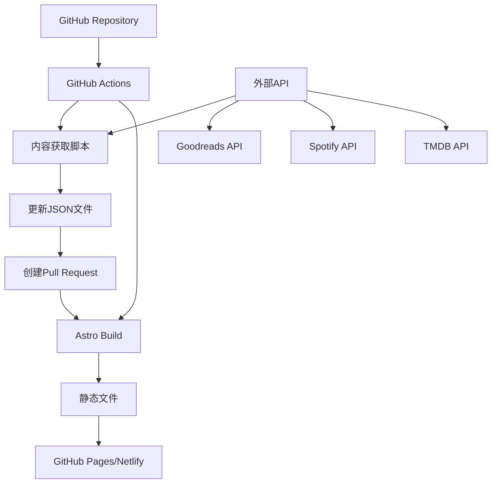

# 设计文档

## 概述

本设计文档基于心理健康支持网站的需求，提供了一个全面的技术架构和设计方案。该网站旨在为全球用户提供温馨、私密、安全的心理健康支持环境，采用去中心化架构，支持渐进式功能部署。

设计核心原则：
- **温馨安全**：视觉设计营造舒适、信任的氛围
- **隐私优先**：完全静态化，无服务器端数据收集
- **多语言支持**：基于现有i18n架构的全球化体验
- **渐进增强**：功能模块化，支持独立部署
- **移动优先**：响应式设计，优化移动端体验
- **暗色主题支持**：提供护眼的暗色模式，适应不同使用场景
- **无障碍访问**：遵循WCAG 2.1 AA标准，确保所有用户都能访问

## 架构

### 技术栈

**前端框架**
- **Astro 5.11.0**: 静态站点生成器，支持多种前端框架集成
- **React 19.1.0**: 用于交互式组件（Islands架构）
- **TypeScript 5.8.3**: 类型安全和开发体验

**样式系统**
- **Tailwind CSS 4.1.11**: 实用优先的CSS框架，内置暗色模式支持
- **DaisyUI 5.0.46**: 基于Tailwind的组件库，提供一致的设计系统
- **@tailwindcss/typography**: 优化的文本排版样式
- **暗色主题系统**: 基于CSS变量和Tailwind的dark:前缀实现
- **无障碍访问工具**: 键盘导航、屏幕阅读器支持、高对比度模式

**国际化**
- **astro-i18n-aut 0.7.3**: 自动化国际化解决方案
- **现有模块化翻译系统**: `src/locales/` 目录结构

**内容管理**
- **Astro Content Collections**: 类型安全的内容管理
- **Markdown**: 指南内容格式
- **JSON**: 资源数据格式

### 部署架构



## 组件和接口

### 核心页面组件

#### 1. 首页组件 (`src/pages/index.astro`)
- **功能**: 网站入口，展示使命和导航
- **接口**: `useHomeTranslations(lang)`
- **设计**: 温馨欢迎界面，清晰的功能导航

#### 2. 指南页面组件 (`src/pages/guide/`)
- **功能**: 心理健康自助指南展示
- **接口**: `useGuideTranslations(lang)`
- **设计**: 分类浏览，舒适阅读体验

#### 3. 资源页面组件 (`src/pages/resources/`)
- **功能**: 治疗资源推荐展示
- **接口**: `useResourcesTranslations(lang)`
- **设计**: 卡片式布局，筛选和分类功能

#### 4. 关于页面组件 (`src/pages/about.astro`)
- **功能**: 网站介绍和团队信息
- **接口**: `useAboutTranslations(lang)`
- **设计**: 信任建立，透明度展示

#### 5. 海报分享组件 (`src/components/PosterGenerator/`)
- **功能**: 生成可分享的心理健康海报
- **类型**: 
  - 励志语录海报
  - 测评结果海报
  - 每日提醒海报
  - 成就分享海报
- **设计**: 美观的视觉设计，包含网站品牌信息

### 共享组件

#### 1. Header组件 (`src/components/Header.astro`)
- **现有功能**: 导航、语言切换、主题切换
- **增强**: 移动端优化，无障碍访问
- **设计**: 固定顶部，毛玻璃效果

#### 2. Footer组件 (`src/components/Footer.astro`)
- **功能**: 网站信息、链接、版权
- **设计**: 简洁信息展示

#### 3. LanguageSwitcher组件 (`src/components/LanguageSwitcher.tsx`)
- **现有功能**: 多语言切换
- **增强**: 更好的用户体验和视觉反馈

### 内容获取系统

#### 1. 内容获取脚本 (`scripts/content-fetcher/`)
```typescript
interface ContentFetcher {
  fetchBooks(): Promise<BookResource[]>
  fetchMovies(): Promise<MovieResource[]>
  fetchMusic(): Promise<MusicResource[]>
  validateContent(content: any): boolean
  updateResourceFiles(resources: ResourceData): Promise<void>
}
```

#### 2. GitHub Actions工作流 (`.github/workflows/`)
- **定时任务**: 每周自动执行内容更新
- **手动触发**: 支持按需更新
- **错误处理**: 失败通知和回滚机制

#### 3. 海报生成系统 (`src/components/PosterGenerator/`)
```typescript
interface PosterGenerator {
  generateQuotePoster(quote: Quote, template: PosterTemplate): Promise<Blob>
  generateAssessmentPoster(result: any, template: PosterTemplate): Promise<Blob>
  downloadPoster(posterBlob: Blob, filename: string): void
  sharePoster(posterBlob: Blob, platform: 'twitter' | 'instagram' | 'facebook'): void
}
```

#### 4. 语录管理系统 (`src/content/quotes/`)
- **数据源**: 精选的心理健康相关语录
- **分类**: 按情绪、主题、作者分类
- **多语言**: 支持所有网站语言
- **更新机制**: 通过内容获取脚本自动更新

## 数据模型

### 资源数据模型

```typescript
interface ResourceItem {
  id: string
  title: string
  description: string
  
  // 书籍特有字段
  author?: string
  year?: number
  genre?: string
  pages?: number
  themes?: string[]
  benefits?: string[]
  isbn?: string
  amazonUrl?: string
  goodreadsUrl?: string
  
  // 电影特有字段
  director?: string
  duration?: string
  rating?: string
  streamingUrl?: string
  trailerUrl?: string
  
  // 音乐特有字段
  artist?: string
  type?: string
  spotifyUrl?: string
  youtubeUrl?: string
  
  // 通用字段
  image?: string
}

interface ResourceCollection {
  title: string
  description: string
  items: ResourceItem[]
}

interface MultiLanguageResources {
  [language: string]: ResourceCollection
}
```

### 海报分享数据模型

```typescript
interface Quote {
  id: string
  text: string
  author?: string
  category: 'motivation' | 'healing' | 'mindfulness' | 'growth'
  tags: string[]
  language: string
}

interface PosterTemplate {
  id: string
  name: string
  type: 'quote' | 'assessment' | 'reminder' | 'achievement'
  backgroundImage?: string
  backgroundColor: string
  textColor: string
  layout: 'centered' | 'bottom' | 'side'
  fontFamily: string
  fontSize: number
}

interface PosterConfig {
  template: PosterTemplate
  content: {
    mainText: string
    subText?: string
    authorText?: string
    websiteInfo: {
      name: string
      url: string
      logo: string
    }
  }
  dimensions: {
    width: number
    height: number
    format: 'square' | 'story' | 'post'
  }
}
```

### 指南内容模型

```typescript
interface GuideContent {
  title: string
  description: string
  author?: string
  publishDate: Date
  updateDate?: Date
  tags?: string[]
  featured: boolean
  content: string // Markdown内容
}
```

## 错误处理

### 前端错误处理

1. **翻译缺失处理**
   - 自动回退到英语
   - 开发环境警告日志
   - 用户友好的错误提示

2. **内容加载失败**
   - 优雅降级显示
   - 重试机制
   - 离线内容缓存

3. **网络连接问题**
   - 静态内容优先
   - 渐进式增强
   - 服务工作者缓存

### 内容获取错误处理

1. **API调用失败**
   - 重试机制（指数退避）
   - 详细错误日志
   - 邮件/Slack通知

2. **内容验证失败**
   - 跳过无效内容
   - 记录验证错误
   - 保持现有内容

3. **文件更新失败**
   - 事务性更新
   - 回滚机制
   - 状态检查

## 测试策略

### 单元测试
- **翻译函数测试**: 确保所有语言的翻译正确性
- **内容验证测试**: 验证资源数据格式和完整性
- **组件渲染测试**: React组件的正确渲染

### 集成测试
- **页面导航测试**: 多语言页面间的导航
- **内容获取测试**: 脚本的端到端功能
- **构建流程测试**: Astro构建和部署流程

### 端到端测试
- **用户体验测试**: 完整的用户旅程
- **多设备测试**: 响应式设计验证
- **性能测试**: 页面加载和交互性能

### 内容质量测试
- **可访问性测试**: WCAG 2.1 AA标准
- **SEO测试**: 搜索引擎优化验证
- **多语言测试**: 所有支持语言的功能验证

## 设计系

### 色彩方案

**亮色主题** - 温暖、安全的色彩
- 主色: `#3B82F6` (蓝色 - 信任、平静)
- 辅助色: `#10B981` (绿色 - 成长、希望)
- 警告色: `#F59E0B` (橙色 - 注意、温暖)
- 错误色: `#EF4444` (红色 - 紧急、重要)
- 文本: `#1F2937` (深灰)
- 背景: `#F9FAFB` (浅灰)
- 边框: `#E5E7EB` (中灰)

**暗色主题** - 护眼、舒适的色彩
- 主色: `#60A5FA` (亮蓝色 - 在暗背景下的信任色)
- 辅助色: `#34D399` (亮绿色 - 在暗背景下的希望色)
- 警告色: `#FBBF24` (亮橙色 - 在暗背景下的注意色)
- 错误色: `#F87171` (亮红色 - 在暗背景下的重要色)
- 文本: `#F9FAFB` (浅色文本)
- 背景: `#111827` (深色背景)
- 边框: `#374151` (深灰边框)

**无障碍访问色彩**
- 高对比度模式支持
- 色盲友好的色彩搭配
- 最小对比度比例 4.5:1 (正文) 和 3:1 (大文本)

### 排版系统

**字体层级**
- 标题: `text-4xl` - `text-lg`
- 正文: `text-base`
- 小字: `text-sm`
- 说明: `text-xs`

**字体权重**
- 标题: `font-bold` (700)
- 强调: `font-semibold` (600)
- 正文: `font-normal` (400)

### 间距系统

**组件间距**
- 大间距: `space-y-8` (32px)
- 中间距: `space-y-4` (16px)
- 小间距: `space-y-2` (8px)

**页面布局**
- 容器: `max-w-7xl mx-auto px-4`
- 内容区: `max-w-4xl mx-auto`
- 侧边栏: `w-64`

### 交互设计

**按钮状态**
- 默认: 清晰的视觉层次
- 悬停: 轻微的颜色变化和阴影
- 激活: 明显的视觉反馈
- 禁用: 降低透明度
- 焦点: 明显的焦点指示器 (focus ring)

**过渡动画**
- 页面切换: 平滑的淡入淡出
- 组件交互: 微妙的缩放和颜色变化
- 加载状态: 优雅的骨架屏
- 主题切换: 平滑的颜色过渡动画

**无障碍访问交互**
- 键盘导航支持 (Tab, Enter, Space, Arrow keys)
- 屏幕阅读器友好的语义化标签
- 跳转链接 (Skip links) 用于快速导航
- 焦点管理和焦点陷阱 (Focus trap)
- 适当的ARIA标签和角色
- 动画减少选项 (prefers-reduced-motion)

## 性能优化

### 静态生成优化
- **代码分割**: Astro Islands架构
- **图片优化**: 自动WebP转换和响应式图片
- **CSS优化**: Tailwind的purge功能
- **JavaScript最小化**: 仅必要的客户端代码

### 内容交付优化
- **CDN部署**: GitHub Pages或Netlify
- **缓存策略**: 长期缓存静态资源
- **预加载**: 关键资源的预加载
- **懒加载**: 图片和非关键内容的懒加载

### 移动端优化
- **移动优先**: 响应式设计原则
- **触摸友好**: 适当的点击目标大小
- **快速加载**: 优化的资源大小
- **离线支持**: 服务工作者缓存

## 安全考虑

### 内容安全
- **输入验证**: 严格的内容格式验证
- **XSS防护**: 安全的Markdown渲染
- **内容审核**: 自动化和人工审核结合

### 隐私保护
- **无追踪**: 不使用分析和追踪脚本
- **本地存储**: 仅必要的本地数据存储
- **第三方服务**: 最小化外部依赖

### 部署安全
- **HTTPS强制**: 所有连接使用HTTPS
- **安全头**: 适当的HTTP安全头设置
- **依赖更新**: 定期更新依赖包

这个设计为心理健康支持网站提供了一个全面、可扩展的技术架构，确保用户能够在一个安全、温馨的环境中获得所需的支持和资源。