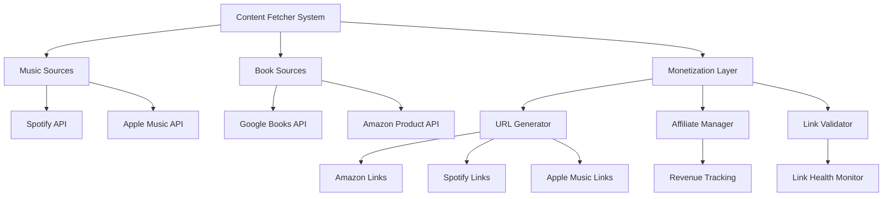

# Design Document

## Overview

This design enhances the mental health website's resource monetization system by implementing Apple Music integration, fixing Amazon affiliate links, and establishing a comprehensive revenue optimization framework. The solution maintains user experience quality while introducing ethical monetization strategies.

## Architecture

### System Components



### Data Flow

1. **Content Fetching**: Multi-source aggregation with fallback mechanisms
2. **Link Generation**: Centralized URL generation with affiliate integration
3. **Validation**: Automated link health checking and repair
4. **Monetization**: Transparent affiliate link management

## Components and Interfaces

### 1. Enhanced Apple Music Integration

#### Apple Music JWT Service
```typescript
interface AppleMusicJWTService {
  generateToken(): Promise<string>;
  refreshToken(): Promise<string>;
  validateToken(token: string): boolean;
}
```

#### Apple Music API Client
```typescript
interface AppleMusicClient {
  searchPlaylists(query: string): Promise<AppleMusicPlaylist[]>;
  getPlaylistDetails(id: string): Promise<AppleMusicPlaylist>;
  searchAlbums(query: string): Promise<AppleMusicAlbum[]>;
}
```

### 2. Enhanced URL Generation System

#### Monetization Configuration
```typescript
interface MonetizationConfig {
  amazon: {
    affiliateTag: string;
    regions: Record<string, string>;
    apiKey?: string; // For product validation
  };
  spotify: {
    partnerCode: string;
  };
  appleMusic: {
    affiliateToken: string;
    campaignToken?: string;
  };
  disclosure: {
    enabled: boolean;
    message: string;
  };
}
```

#### Enhanced URL Generator
```typescript
interface URLGenerator {
  generateAmazonUrl(isbn: string, region?: string): Promise<string>;
  validateAmazonUrl(url: string): Promise<boolean>;
  repairAmazonUrl(brokenUrl: string): Promise<string>;
  generateAppleMusicUrl(id: string, type: string): string;
  generateMultiPlatformLinks(resource: ResourceItem): PlatformLinks;
}
```

### 3. Link Health Management

#### Link Validator Service
```typescript
interface LinkValidator {
  validateLink(url: string): Promise<LinkValidationResult>;
  batchValidate(urls: string[]): Promise<LinkValidationResult[]>;
  scheduleValidation(urls: string[], interval: string): void;
}

interface LinkValidationResult {
  url: string;
  isValid: boolean;
  statusCode?: number;
  error?: string;
  suggestedFix?: string;
}
```

### 4. Revenue Optimization Framework

#### Affiliate Manager
```typescript
interface AffiliateManager {
  trackClick(url: string, source: string): Promise<void>;
  generateReport(period: DateRange): Promise<RevenueReport>;
  optimizeLinks(performance: LinkPerformance[]): Promise<OptimizationSuggestions>;
}
```

## Data Models

### Enhanced Resource Item
```typescript
interface ResourceItem {
  // Existing fields...
  
  // Enhanced monetization fields
  platformLinks: {
    amazon?: AmazonLink;
    spotify?: SpotifyLink;
    appleMusic?: AppleMusicLink;
    goodreads?: string;
  };
  
  // Link health tracking
  linkHealth: {
    lastValidated: Date;
    validationStatus: 'valid' | 'invalid' | 'pending';
    issues?: string[];
  };
  
  // Revenue tracking
  monetization: {
    hasAffiliateLinks: boolean;
    platforms: string[];
    lastOptimized: Date;
  };
}

interface AmazonLink {
  url: string;
  asin: string;
  region: string;
  hasAffiliateTag: boolean;
  lastValidated: Date;
}

interface AppleMusicLink {
  url: string;
  id: string;
  type: 'playlist' | 'album' | 'song';
  hasAffiliateToken: boolean;
}
```

### Apple Music Data Models
```typescript
interface AppleMusicPlaylist {
  id: string;
  name: string;
  description?: string;
  curatorName: string;
  artwork?: AppleMusicArtwork;
  url: string;
  trackCount: number;
}

interface AppleMusicArtwork {
  width: number;
  height: number;
  url: string;
}
```

## Error Handling

### Graceful Degradation Strategy

1. **Apple Music Unavailable**: Fall back to Spotify-only music fetching
2. **Amazon API Issues**: Use ISBN-based URL generation without validation
3. **Affiliate Link Failures**: Provide non-affiliate links as fallback
4. **JWT Token Expiry**: Automatic token refresh with retry logic

### Error Recovery Mechanisms

```typescript
interface ErrorRecoveryStrategy {
  retryWithBackoff(operation: () => Promise<any>, maxRetries: number): Promise<any>;
  fallbackToAlternativeSource(primarySource: string, fallbackSources: string[]): Promise<any>;
  gracefulDegrade(feature: string, fallbackBehavior: () => any): any;
}
```

## Testing Strategy

### Unit Testing
- Apple Music JWT token generation and validation using real Apple Music API
- URL generation with actual affiliate parameters
- Link validation against live Amazon/Spotify/Apple Music endpoints
- Revenue tracking with real click data

### Integration Testing
- Apple Music API authentication flow with actual developer credentials
- Multi-platform link generation using live APIs
- End-to-end content fetching from real data sources
- Error handling with actual API failure scenarios

### Performance Testing
- Concurrent API calls to live music platform endpoints
- Link validation against real URLs in production
- Large-scale content aggregation from actual APIs

### Security Testing
- JWT token security using Apple's actual authentication requirements
- Affiliate link parameter validation against real platform specifications
- API key protection following actual service provider guidelines

## Implementation Phases

### Phase 1: Apple Music Integration
- Implement JWT token service using Apple's MusicKit API requirements
- Create Apple Music API client with real authentication
- Integrate with existing music fetcher using live Apple Music catalog
- Add Apple Music affiliate link generation with actual partner tokens

### Phase 2: Amazon Link Enhancement
- Implement Amazon Product Advertising API integration for URL validation
- Create link repair mechanisms using real ASIN/ISBN lookups
- Add affiliate tag management with actual Amazon Associates program
- Implement batch link health checking against live Amazon endpoints

### Phase 3: Revenue Optimization
- Create affiliate tracking system using real click tracking APIs
- Implement performance analytics with actual revenue data
- Add link optimization based on real conversion metrics
- Create revenue reporting using actual affiliate program APIs

### Phase 4: Production Deployment
- Deploy to production with real API credentials
- Set up monitoring using actual service health endpoints
- Implement alerting based on real error rates and revenue metrics
- Add automated optimization using live performance data

## Security Considerations

### API Key Management
- Store sensitive credentials in environment variables
- Implement key rotation mechanisms
- Use encrypted storage for JWT private keys
- Monitor API usage and rate limits

### Privacy Protection
- Ensure affiliate links don't track user behavior beyond clicks
- Implement transparent disclosure of monetization
- Respect user privacy preferences
- Comply with relevant privacy regulations

### Data Integrity
- Validate all external API responses
- Implement content sanitization
- Ensure affiliate parameters don't break functionality
- Monitor for malicious link injection

## Performance Optimizations

### Caching Strategy
- Cache Apple Music JWT tokens until actual expiry (1 hour as per Apple's spec)
- Cache validated link statuses based on real HTTP response codes
- Implement content-based caching for actual API responses with appropriate TTL
- Use real CDN services for affiliate link redirects with proper analytics

### Rate Limiting
- Implement exponential backoff based on actual API rate limit responses
- Batch requests according to each platform's specific API limitations
- Use connection pooling optimized for real API endpoint requirements
- Monitor and respect actual rate limits from Apple Music (1000 requests/hour), Spotify (varies by endpoint), and Amazon Product API

### Monitoring and Alerting
- Track API response times and success rates
- Monitor affiliate link click-through rates
- Alert on broken link detection
- Track revenue performance metrics