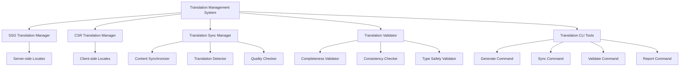

# 翻译完整性修复设计文档

## 概述

本设计文档针对现有心理健康平台的翻译系统提供完整性修复方案。当前系统存在SSG和CSR翻译文件混用、翻译缺失、质量不一致等问题。本设计将创建清晰的翻译架构分离，实现完整的翻译管理工具链，并确保所有语言的翻译完整性。

## 架构设计

### 翻译文件架构分离

```
packages/website/src/
├── locales/                    # SSG 翻译文件（服务端渲染）
│   ├── assessment/             # 评测系统（包含SSG和CSR内容）
│   ├── shared/                 # 共享组件（主要SSG）
│   ├── home/                   # 首页（主要SSG）
│   ├── guide/                  # 指南页面（主要SSG）
│   ├── resources/              # 资源页面（主要SSG）
│   └── about/                  # 关于页面（纯SSG）
└── client-locales/             # CSR 翻译文件（客户端渲染）
    ├── assessment/             # 评测系统客户端组件
    │   ├── index.ts
    │   ├── en.ts
    │   ├── zh.ts
    │   ├── es.ts
    │   ├── ja.ts
    │   ├── ko.ts
    │   ├── hi.ts
    │   ├── ar.ts
    │   └── types.ts
    └── shared/                 # 共享客户端组件（如果有的话）
        └── ...
```

**注意：** 只有包含客户端交互组件的模块才需要在 `client-locales` 中创建对应的翻译文件。纯静态页面（如about页面）只需要SSG翻译文件即可。

### 翻译系统组件架构



## 组件设计

### 1. 翻译文件结构标准化

#### SSG翻译文件接口
```typescript
// packages/website/src/locales/shared/types.ts
export interface BaseTranslations {
  [key: string]: string | BaseTranslations;
}

export interface SSGTranslations extends BaseTranslations {
  // SSG特定的翻译结构
  meta: {
    title: string;
    description: string;
    keywords: string;
  };
  navigation: {
    [key: string]: string;
  };
  content: {
    [key: string]: string | BaseTranslations;
  };
}
```

#### CSR翻译文件接口
```typescript
// packages/website/src/client-locales/shared/types.ts
export interface CSRTranslations extends BaseTranslations {
  // CSR特定的翻译结构
  client: {
    loading: {
      [key: string]: string;
    };
    errors: {
      [key: string]: string;
    };
    actions: {
      [key: string]: string;
    };
  };
  interactive: {
    [key: string]: string | BaseTranslations;
  };
}
```

### 2. 翻译管理器

#### SSG翻译管理器
```typescript
// packages/website/src/utils/ssg-translation-manager.ts
import type { Language } from '@sunrain/shared';
import type { SSGTranslations } from '@/locales/shared/types';

export class SSGTranslationManager {
  private static instance: SSGTranslationManager;
  private translationCache = new Map<string, SSGTranslations>();

  static getInstance(): SSGTranslationManager {
    if (!SSGTranslationManager.instance) {
      SSGTranslationManager.instance = new SSGTranslationManager();
    }
    return SSGTranslationManager.instance;
  }

  async loadTranslations(namespace: string, language: Language): Promise<SSGTranslations> {
    const cacheKey = `${namespace}:${language}`;
    
    if (this.translationCache.has(cacheKey)) {
      return this.translationCache.get(cacheKey)!;
    }

    try {
      const module = await import(`@/locales/${namespace}/${language}`);
      const translations = module.default || module[`${namespace}${language.charAt(0).toUpperCase() + language.slice(1)}`];
      
      this.translationCache.set(cacheKey, translations);
      return translations;
    } catch (error) {
      console.error(`Failed to load SSG translations for ${cacheKey}:`, error);
      
      // 回退到默认语言
      if (language !== 'en') {
        return this.loadTranslations(namespace, 'en');
      }
      
      throw error;
    }
  }

  formatMessage(template: string, params: Record<string, any> = {}): string {
    return template.replace(/\{(\w+)\}/g, (match, key) => {
      return params[key] !== undefined ? String(params[key]) : match;
    });
  }
}
```

#### CSR翻译管理器
```typescript
// packages/website/src/utils/csr-translation-manager.ts
import type { Language } from '@sunrain/shared';
import type { CSRTranslations } from '@/client-locales/shared/types';

export class CSRTranslationManager {
  private static instance: CSRTranslationManager;
  private translationCache = new Map<string, CSRTranslations>();
  private loadingPromises = new Map<string, Promise<CSRTranslations>>();

  static getInstance(): CSRTranslationManager {
    if (!CSRTranslationManager.instance) {
      CSRTranslationManager.instance = new CSRTranslationManager();
    }
    return CSRTranslationManager.instance;
  }

  async loadTranslations(namespace: string, language: Language): Promise<CSRTranslations> {
    const cacheKey = `${namespace}:${language}`;
    
    // 检查缓存
    if (this.translationCache.has(cacheKey)) {
      return this.translationCache.get(cacheKey)!;
    }

    // 检查是否正在加载
    if (this.loadingPromises.has(cacheKey)) {
      return this.loadingPromises.get(cacheKey)!;
    }

    // 创建加载Promise
    const loadingPromise = this.performLoad(namespace, language, cacheKey);
    this.loadingPromises.set(cacheKey, loadingPromise);

    try {
      const result = await loadingPromise;
      return result;
    } finally {
      this.loadingPromises.delete(cacheKey);
    }
  }

  private async performLoad(namespace: string, language: Language, cacheKey: string): Promise<CSRTranslations> {
    try {
      const module = await import(`@/client-locales/${namespace}/${language}`);
      const translations = module.default || module[`${namespace}${language.charAt(0).toUpperCase() + language.slice(1)}`];
      
      this.translationCache.set(cacheKey, translations);
      return translations;
    } catch (error) {
      console.error(`Failed to load CSR translations for ${cacheKey}:`, error);
      
      // 回退到默认语言
      if (language !== 'en') {
        return this.loadTranslations(namespace, 'en');
      }
      
      throw error;
    }
  }

  formatMessage(template: string, params: Record<string, any> = {}): string {
    return template.replace(/\{(\w+)\}/g, (match, key) => {
      return params[key] !== undefined ? String(params[key]) : match;
    });
  }

  preloadTranslations(namespaces: string[], languages: Language[]): Promise<void[]> {
    const promises: Promise<void>[] = [];

    for (const namespace of namespaces) {
      for (const language of languages) {
        promises.push(
          this.loadTranslations(namespace, language).then(() => {})
        );
      }
    }

    return Promise.all(promises);
  }
}
```

### 3. 翻译同步管理器

```typescript
// packages/website/src/utils/translation-sync-manager.ts
import fs from 'fs/promises';
import path from 'path';
import type { Language } from '@sunrain/shared';

export interface TranslationSyncConfig {
  sourceDir: string;
  targetDir: string;
  supportedLanguages: Language[];
  defaultLanguage: Language;
  namespaces: string[];
}

export class TranslationSyncManager {
  constructor(private config: TranslationSyncConfig) {}

  async syncTranslations(): Promise<void> {
    console.log('Starting translation synchronization...');

    for (const namespace of this.config.namespaces) {
      await this.syncNamespace(namespace);
    }

    console.log('Translation synchronization completed');
  }

  private async syncNamespace(namespace: string): Promise<void> {
    console.log(`Syncing namespace: ${namespace}`);

    // 读取源翻译文件（SSG）
    const sourceTranslations = await this.loadSourceTranslations(namespace);
    
    // 生成目标翻译文件（CSR）
    await this.generateTargetTranslations(namespace, sourceTranslations);
    
    // 验证同步结果
    await this.validateSync(namespace);
  }

  private async loadSourceTranslations(namespace: string): Promise<Record<Language, any>> {
    const translations: Record<Language, any> = {} as Record<Language, any>;

    for (const language of this.config.supportedLanguages) {
      const filePath = path.join(this.config.sourceDir, namespace, `${language}.ts`);
      
      try {
        // 动态导入TypeScript文件
        const module = await import(filePath);
        translations[language] = module.default || module[`${namespace}${language.charAt(0).toUpperCase() + language.slice(1)}`];
      } catch (error) {
        console.warn(`Failed to load source translation: ${filePath}`, error);
      }
    }

    return translations;
  }

  private async generateTargetTranslations(namespace: string, sourceTranslations: Record<Language, any>): Promise<void> {
    for (const language of this.config.supportedLanguages) {
      const sourceTranslation = sourceTranslations[language];
      if (!sourceTranslation) continue;

      // 转换为CSR格式
      const csrTranslation = this.convertToCSRFormat(sourceTranslation);
      
      // 只有包含客户端内容时才生成目标文件
      if (csrTranslation) {
        const targetPath = path.join(this.config.targetDir, namespace, `${language}.ts`);
        await this.writeTranslationFile(targetPath, csrTranslation, namespace, language);
      } else {
        console.log(`Skipping CSR translation for ${namespace}:${language} - no client content found`);
      }
    }
  }

  private convertToCSRFormat(ssgTranslation: any): any | null {
    // 检查是否包含客户端内容
    const hasClientContent = this.hasClientContent(ssgTranslation);
    if (!hasClientContent) {
      return null; // 不需要创建CSR翻译文件
    }

    // 提取客户端相关的翻译内容
    const csrTranslation = {
      client: ssgTranslation.client || {},
      interactive: {},
      errors: ssgTranslation.errors || {},
      loading: ssgTranslation.loading || {},
      actions: ssgTranslation.actions || {}
    };

    // 递归提取交互式内容
    this.extractInteractiveContent(ssgTranslation, csrTranslation.interactive);

    return csrTranslation;
  }

  private hasClientContent(translation: any): boolean {
    // 检查是否包含客户端相关的内容
    const clientIndicators = ['client', 'interactive', 'actions', 'loading', 'errors'];
    
    for (const indicator of clientIndicators) {
      if (translation[indicator] && Object.keys(translation[indicator]).length > 0) {
        return true;
      }
    }

    // 递归检查嵌套对象
    return this.hasClientContentRecursive(translation);
  }

  private hasClientContentRecursive(obj: any): boolean {
    for (const [key, value] of Object.entries(obj)) {
      if (typeof value === 'object' && value !== null) {
        if (this.isClientContent(key, '') || this.hasClientContentRecursive(value)) {
          return true;
        }
      }
    }
    return false;
  }

  private extractInteractiveContent(source: any, target: any, prefix: string = ''): void {
    for (const [key, value] of Object.entries(source)) {
      if (typeof value === 'object' && value !== null) {
        target[key] = {};
        this.extractInteractiveContent(value, target[key], `${prefix}${key}.`);
      } else if (typeof value === 'string') {
        // 只提取可能在客户端使用的内容
        if (this.isClientContent(key, prefix)) {
          target[key] = value;
        }
      }
    }
  }

  private isClientContent(key: string, prefix: string): boolean {
    const clientKeywords = [
      'button', 'action', 'error', 'loading', 'placeholder', 
      'validation', 'confirm', 'cancel', 'save', 'delete',
      'progress', 'status', 'message'
    ];

    const fullKey = `${prefix}${key}`.toLowerCase();
    return clientKeywords.some(keyword => fullKey.includes(keyword));
  }

  private async writeTranslationFile(filePath: string, translation: any, namespace: string, language: Language): Promise<void> {
    const dir = path.dirname(filePath);
    await fs.mkdir(dir, { recursive: true });

    const content = this.generateTranslationFileContent(translation, namespace, language);
    await fs.writeFile(filePath, content, 'utf-8');
  }

  private generateTranslationFileContent(translation: any, namespace: string, language: Language): string {
    const exportName = `${namespace}${language.charAt(0).toUpperCase() + language.slice(1)}`;
    
    return `/**
 * ${namespace} 系统${language === 'zh' ? '中文' : language === 'en' ? '英文' : language}翻译内容 (CSR)
 * 此文件由翻译同步工具自动生成，请勿手动编辑
 */
import type { CSRTranslations } from '../shared/types';

export const ${exportName}: CSRTranslations = ${JSON.stringify(translation, null, 2)};

export default ${exportName};
`;
  }

  async validateSync(namespace: string): Promise<void> {
    console.log(`Validating sync for namespace: ${namespace}`);

    for (const language of this.config.supportedLanguages) {
      const sourcePath = path.join(this.config.sourceDir, namespace, `${language}.ts`);
      const targetPath = path.join(this.config.targetDir, namespace, `${language}.ts`);

      const sourceExists = await this.fileExists(sourcePath);
      const targetExists = await this.fileExists(targetPath);

      if (sourceExists && !targetExists) {
        console.warn(`Missing target translation: ${targetPath}`);
      }
    }
  }

  private async fileExists(filePath: string): Promise<boolean> {
    try {
      await fs.access(filePath);
      return true;
    } catch {
      return false;
    }
  }
}
```

### 4. 翻译验证器

```typescript
// packages/website/src/utils/translation-validator.ts
import type { Language } from '@sunrain/shared';

export interface ValidationResult {
  isValid: boolean;
  errors: ValidationError[];
  warnings: ValidationWarning[];
  completeness: CompletenessReport;
}

export interface ValidationError {
  type: 'missing_key' | 'type_mismatch' | 'invalid_format';
  namespace: string;
  language: Language;
  key: string;
  message: string;
}

export interface ValidationWarning {
  type: 'untranslated' | 'inconsistent' | 'deprecated';
  namespace: string;
  language: Language;
  key: string;
  message: string;
}

export interface CompletenessReport {
  total: number;
  translated: number;
  percentage: number;
  byLanguage: Record<Language, { total: number; translated: number; percentage: number }>;
}

export class TranslationValidator {
  constructor(
    private supportedLanguages: Language[],
    private defaultLanguage: Language = 'en'
  ) {}

  async validateTranslations(
    ssgTranslationsDir: string,
    csrTranslationsDir: string,
    namespaces: string[]
  ): Promise<ValidationResult> {
    const errors: ValidationError[] = [];
    const warnings: ValidationWarning[] = [];
    let totalKeys = 0;
    let translatedKeys = 0;
    const byLanguage: Record<Language, { total: number; translated: number; percentage: number }> = {} as any;

    for (const namespace of namespaces) {
      // 验证SSG翻译
      const ssgResult = await this.validateNamespace(ssgTranslationsDir, namespace, 'ssg');
      errors.push(...ssgResult.errors);
      warnings.push(...ssgResult.warnings);

      // 验证CSR翻译
      const csrResult = await this.validateNamespace(csrTranslationsDir, namespace, 'csr');
      errors.push(...csrResult.errors);
      warnings.push(...csrResult.warnings);

      // 验证SSG和CSR的一致性
      const consistencyResult = await this.validateConsistency(
        ssgTranslationsDir,
        csrTranslationsDir,
        namespace
      );
      errors.push(...consistencyResult.errors);
      warnings.push(...consistencyResult.warnings);

      // 统计完整性
      totalKeys += ssgResult.totalKeys;
      translatedKeys += ssgResult.translatedKeys;

      // 按语言统计
      for (const language of this.supportedLanguages) {
        if (!byLanguage[language]) {
          byLanguage[language] = { total: 0, translated: 0, percentage: 0 };
        }
        byLanguage[language].total += ssgResult.byLanguage[language]?.total || 0;
        byLanguage[language].translated += ssgResult.byLanguage[language]?.translated || 0;
      }
    }

    // 计算百分比
    for (const language of this.supportedLanguages) {
      if (byLanguage[language].total > 0) {
        byLanguage[language].percentage = Math.round(
          (byLanguage[language].translated / byLanguage[language].total) * 100
        );
      }
    }

    const completeness: CompletenessReport = {
      total: totalKeys,
      translated: translatedKeys,
      percentage: totalKeys > 0 ? Math.round((translatedKeys / totalKeys) * 100) : 0,
      byLanguage
    };

    return {
      isValid: errors.length === 0,
      errors,
      warnings,
      completeness
    };
  }

  private async validateNamespace(
    translationsDir: string,
    namespace: string,
    type: 'ssg' | 'csr'
  ): Promise<{
    errors: ValidationError[];
    warnings: ValidationWarning[];
    totalKeys: number;
    translatedKeys: number;
    byLanguage: Record<Language, { total: number; translated: number }>;
  }> {
    const errors: ValidationError[] = [];
    const warnings: ValidationWarning[] = [];
    let totalKeys = 0;
    let translatedKeys = 0;
    const byLanguage: Record<Language, { total: number; translated: number }> = {} as any;

    // 加载默认语言作为基准
    const defaultTranslation = await this.loadTranslation(translationsDir, namespace, this.defaultLanguage);
    if (!defaultTranslation) {
      errors.push({
        type: 'missing_key',
        namespace,
        language: this.defaultLanguage,
        key: '',
        message: `Default language translation file not found: ${namespace}/${this.defaultLanguage}`
      });
      return { errors, warnings, totalKeys, translatedKeys, byLanguage };
    }

    const defaultKeys = this.extractKeys(defaultTranslation);
    totalKeys = defaultKeys.length * this.supportedLanguages.length;

    for (const language of this.supportedLanguages) {
      byLanguage[language] = { total: defaultKeys.length, translated: 0 };

      if (language === this.defaultLanguage) {
        byLanguage[language].translated = defaultKeys.length;
        translatedKeys += defaultKeys.length;
        continue;
      }

      const translation = await this.loadTranslation(translationsDir, namespace, language);
      if (!translation) {
        errors.push({
          type: 'missing_key',
          namespace,
          language,
          key: '',
          message: `Translation file not found: ${namespace}/${language}`
        });
        continue;
      }

      const translationKeys = this.extractKeys(translation);
      
      // 检查缺失的键
      for (const key of defaultKeys) {
        if (!translationKeys.includes(key)) {
          errors.push({
            type: 'missing_key',
            namespace,
            language,
            key,
            message: `Missing translation key: ${key}`
          });
        } else {
          const defaultValue = this.getValueByKey(defaultTranslation, key);
          const translatedValue = this.getValueByKey(translation, key);
          
          if (defaultValue === translatedValue) {
            warnings.push({
              type: 'untranslated',
              namespace,
              language,
              key,
              message: `Possibly untranslated text: ${key}`
            });
          } else {
            byLanguage[language].translated++;
            translatedKeys++;
          }
        }
      }

      // 检查多余的键
      for (const key of translationKeys) {
        if (!defaultKeys.includes(key)) {
          warnings.push({
            type: 'deprecated',
            namespace,
            language,
            key,
            message: `Deprecated translation key: ${key}`
          });
        }
      }
    }

    return { errors, warnings, totalKeys, translatedKeys, byLanguage };
  }

  private async validateConsistency(
    ssgDir: string,
    csrDir: string,
    namespace: string
  ): Promise<{ errors: ValidationError[]; warnings: ValidationWarning[] }> {
    const errors: ValidationError[] = [];
    const warnings: ValidationWarning[] = [];

    for (const language of this.supportedLanguages) {
      const ssgTranslation = await this.loadTranslation(ssgDir, namespace, language);
      const csrTranslation = await this.loadTranslation(csrDir, namespace, language);

      if (!ssgTranslation || !csrTranslation) continue;

      // 检查共同键的一致性
      const ssgKeys = this.extractKeys(ssgTranslation);
      const csrKeys = this.extractKeys(csrTranslation);
      const commonKeys = ssgKeys.filter(key => csrKeys.includes(key));

      for (const key of commonKeys) {
        const ssgValue = this.getValueByKey(ssgTranslation, key);
        const csrValue = this.getValueByKey(csrTranslation, key);

        if (ssgValue !== csrValue) {
          warnings.push({
            type: 'inconsistent',
            namespace,
            language,
            key,
            message: `Inconsistent translation between SSG and CSR: ${key}`
          });
        }
      }
    }

    return { errors, warnings };
  }

  private async loadTranslation(dir: string, namespace: string, language: Language): Promise<any> {
    try {
      const filePath = path.join(dir, namespace, `${language}.ts`);
      const module = await import(filePath);
      return module.default || module[`${namespace}${language.charAt(0).toUpperCase() + language.slice(1)}`];
    } catch (error) {
      return null;
    }
  }

  private extractKeys(obj: any, prefix: string = ''): string[] {
    const keys: string[] = [];

    for (const [key, value] of Object.entries(obj)) {
      const fullKey = prefix ? `${prefix}.${key}` : key;

      if (typeof value === 'object' && value !== null) {
        keys.push(...this.extractKeys(value, fullKey));
      } else {
        keys.push(fullKey);
      }
    }

    return keys;
  }

  private getValueByKey(obj: any, key: string): any {
    const keys = key.split('.');
    let current = obj;

    for (const k of keys) {
      if (current && typeof current === 'object' && k in current) {
        current = current[k];
      } else {
        return undefined;
      }
    }

    return current;
  }
}
```

### 5. CLI工具

```typescript
// packages/website/src/scripts/translation-cli.ts
import { Command } from 'commander';
import { TranslationSyncManager } from '../utils/translation-sync-manager';
import { TranslationValidator } from '../utils/translation-validator';
import { supportedLangs, defaultLang } from '@sunrain/shared';

const program = new Command();

program
  .name('translation-cli')
  .description('Translation management CLI tool')
  .version('1.0.0');

program
  .command('sync')
  .description('Sync translations from SSG to CSR')
  .option('-s, --source <dir>', 'Source directory (SSG)', 'src/locales')
  .option('-t, --target <dir>', 'Target directory (CSR)', 'src/client-locales')
  .option('-n, --namespaces <namespaces>', 'Namespaces to sync', 'assessment,shared,home,guide,resources,about')
  .action(async (options) => {
    const namespaces = options.namespaces.split(',');
    
    const syncManager = new TranslationSyncManager({
      sourceDir: options.source,
      targetDir: options.target,
      supportedLanguages: supportedLangs,
      defaultLanguage: defaultLang,
      namespaces
    });

    try {
      await syncManager.syncTranslations();
      console.log('✅ Translation sync completed successfully');
    } catch (error) {
      console.error('❌ Translation sync failed:', error);
      process.exit(1);
    }
  });

program
  .command('validate')
  .description('Validate translation completeness and consistency')
  .option('-s, --ssg-dir <dir>', 'SSG translations directory', 'src/locales')
  .option('-c, --csr-dir <dir>', 'CSR translations directory', 'src/client-locales')
  .option('-n, --namespaces <namespaces>', 'Namespaces to validate', 'assessment,shared,home,guide,resources,about')
  .option('-r, --report <file>', 'Output report file', 'translation-report.json')
  .action(async (options) => {
    const namespaces = options.namespaces.split(',');
    
    const validator = new TranslationValidator(supportedLangs, defaultLang);

    try {
      const result = await validator.validateTranslations(
        options.ssgDir,
        options.csrDir,
        namespaces
      );

      // 输出结果
      console.log(`\n📊 Translation Validation Report`);
      console.log(`================================`);
      console.log(`Overall Completeness: ${result.completeness.percentage}%`);
      console.log(`Total Keys: ${result.completeness.total}`);
      console.log(`Translated Keys: ${result.completeness.translated}`);
      console.log(`Errors: ${result.errors.length}`);
      console.log(`Warnings: ${result.warnings.length}`);

      console.log(`\n📈 By Language:`);
      for (const [lang, stats] of Object.entries(result.completeness.byLanguage)) {
        console.log(`  ${lang}: ${stats.percentage}% (${stats.translated}/${stats.total})`);
      }

      if (result.errors.length > 0) {
        console.log(`\n❌ Errors:`);
        result.errors.forEach(error => {
          console.log(`  ${error.namespace}/${error.language}: ${error.message}`);
        });
      }

      if (result.warnings.length > 0) {
        console.log(`\n⚠️  Warnings:`);
        result.warnings.forEach(warning => {
          console.log(`  ${warning.namespace}/${warning.language}: ${warning.message}`);
        });
      }

      // 保存报告
      if (options.report) {
        await fs.writeFile(options.report, JSON.stringify(result, null, 2));
        console.log(`\n📄 Report saved to: ${options.report}`);
      }

      if (!result.isValid) {
        process.exit(1);
      }
    } catch (error) {
      console.error('❌ Translation validation failed:', error);
      process.exit(1);
    }
  });

program
  .command('generate')
  .description('Generate missing translation files')
  .option('-d, --dir <dir>', 'Translations directory', 'src/locales')
  .option('-n, --namespace <namespace>', 'Namespace to generate', 'shared')
  .option('-l, --languages <languages>', 'Languages to generate', supportedLangs.join(','))
  .action(async (options) => {
    const languages = options.languages.split(',') as Language[];
    
    console.log(`Generating missing translation files for ${options.namespace}...`);

    for (const language of languages) {
      const filePath = path.join(options.dir, options.namespace, `${language}.ts`);
      
      try {
        await fs.access(filePath);
        console.log(`✅ ${language}: File already exists`);
      } catch {
        // 文件不存在，创建基础模板
        const template = generateTranslationTemplate(options.namespace, language);
        
        const dir = path.dirname(filePath);
        await fs.mkdir(dir, { recursive: true });
        await fs.writeFile(filePath, template);
        
        console.log(`✨ ${language}: Generated ${filePath}`);
      }
    }
  });

function generateTranslationTemplate(namespace: string, language: Language): string {
  const exportName = `${namespace}${language.charAt(0).toUpperCase() + language.slice(1)}`;
  
  return `/**
 * ${namespace} 系统${language === 'zh' ? '中文' : language === 'en' ? '英文' : language}翻译内容
 */
import type { I${namespace.charAt(0).toUpperCase() + namespace.slice(1)}Translations } from './types';

export const ${exportName}: I${namespace.charAt(0).toUpperCase() + namespace.slice(1)}Translations = {
  // TODO: 添加翻译内容
};

export default ${exportName};
`;
}

program.parse();
```

## 错误处理

### 翻译加载错误处理
```typescript
export class TranslationErrorHandler {
  static handleLoadError(error: Error, namespace: string, language: Language): string {
    console.error(`Translation load error: ${namespace}:${language}`, error);
    
    // 记录错误到监控系统
    this.reportError(error, { namespace, language });
    
    // 返回友好的错误信息
    return `[Translation Error: ${namespace}.${language}]`;
  }

  static handleMissingKey(key: string, namespace: string, language: Language): string {
    console.warn(`Missing translation key: ${key} in ${namespace}:${language}`);
    
    // 记录缺失的键
    this.reportMissingKey(key, namespace, language);
    
    // 返回键名作为回退
    return key;
  }

  private static reportError(error: Error, context: any): void {
    // 发送到错误监控服务
    if (typeof window !== 'undefined' && window.console) {
      console.group('Translation Error');
      console.error('Error:', error);
      console.log('Context:', context);
      console.groupEnd();
    }
  }

  private static reportMissingKey(key: string, namespace: string, language: Language): void {
    // 收集缺失的键用于后续修复
    const missingKey = { key, namespace, language, timestamp: Date.now() };
    
    if (typeof window !== 'undefined') {
      const existing = JSON.parse(localStorage.getItem('missing-translations') || '[]');
      existing.push(missingKey);
      localStorage.setItem('missing-translations', JSON.stringify(existing.slice(-100))); // 保留最近100个
    }
  }
}
```

## 测试策略

### 单元测试
- 翻译管理器功能测试
- 翻译验证器逻辑测试
- 错误处理机制测试

### 集成测试
- SSG和CSR翻译系统集成测试
- 翻译同步流程测试
- 多语言切换测试

### 端到端测试
- 完整的翻译工作流测试
- 用户界面多语言体验测试
- 性能和缓存测试
